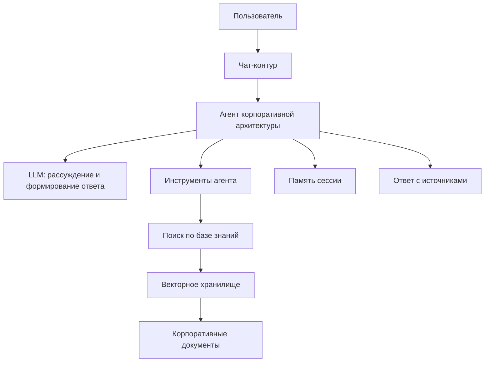

# System architecture: как устроен архитектурный контур

Платформа состоит не из одного “чат-бота”, а из нескольких согласованных контуров: пользовательского диалога, агентного рассуждения, поиска по базе знаний, ingestion документов, памяти сессии и эксплуатационной готовности.

## Ключевая схема

## Как читать эту архитектуру

- **Чат-контур** отвечает за взаимодействие с пользователем и потоковую выдачу ответа.
- **Agent runtime** управляет циклом: вызвать модель, разобрать действие, выполнить инструмент, вернуть финальный ответ.
- **Tools** задают безопасные действия агента. В текущем контуре ключевой инструмент — `search_kb`.
- **Retrieval** превращает вопрос в смысловой поиск по базе знаний.
- **Ingestion** превращает документы в фрагменты, пригодные для поиска.
- **Operations** показывает, готов ли весь контур к работе, а не только запущен ли процесс.

## Почему это важно для архитектурной функции

Архитектура системы повторяет работу зрелого архитектурного офиса: сначала понять вопрос, затем при необходимости обратиться к источникам, затем сформировать позицию и показать основание. Поэтому RAG здесь не “плагин к LLM”, а механизм управляемой аргументации.

## Детальный разбор

Полный учебный разбор с диаграммами: [generated/03-system-architecture.md](../generated/03-system-architecture.md).

[← Architecture](index.md) · [Cross-area runbook](../legends/cross-area-runbook.md)
