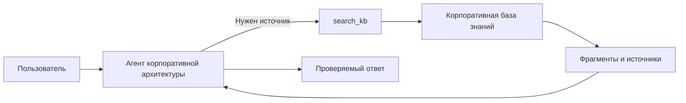

# 01 — Executive overview

## Назначение системы

**ea-agent-platform** — self-hosted платформа для агентного управления корпоративной архитектурой. Она соединяет LLM, корпоративную базу знаний, инструменты поиска, потоковый чат и промышленный ingestion документов.

## Сводка для руководителя

Платформа создает единый диалоговый контур, через который пользователь может задавать вопросы по архитектурным материалам компании и получать ответы с проверяемыми источниками. Главная ценность — не “чат-бот”, а управляемая архитектурная функция: знания становятся доступными, ответы становятся трассируемыми, а процесс включения новых документов становится воспроизводимым.

## Управленческая проблема

| Симптом | Риск для компании | Как отвечает платформа |
|---------|-------------------|------------------------|
| Архитектурные знания распределены по файлам и экспертам | Решения принимаются медленно и зависят от носителей знания | Документы индексируются в единой базе знаний |
| AI-ответы без источников вызывают недоверие | Невозможно использовать ответ в управленческом решении | Ответ сопровождается citations |
| Несколько “ролей” и сценариев усложняют контур | Пользователь не понимает, к кому обращается | Используется единый агент корпоративной архитектуры |
| Поиск перед каждым ответом создает шум | Простые вопросы становятся медленными и перегруженными контекстом | RAG вызывается on-demand через `search_kb` |

## Целевые роли

| Роль | Что получает |
|------|--------------|
| C-level / руководитель функции | Быструю проверяемую позицию по архитектурному вопросу |
| Enterprise architect | Диалоговый доступ к политикам, стандартам, техрадару и решениям |
| Оператор базы знаний | Управляемый контур загрузки и переиндексации документов |
| Инженерная команда | Расширяемый runtime, tools и retrieval-контур |
| Эксплуатация | Health, readiness и диагностику зависимостей |

## Что уже реализовано

| Возможность | Значение для бизнеса |
|-------------|----------------------|
| Единый агент корпоративной архитектуры | Один язык ответа и единая логика консультации |
| `search_kb` как инструмент агента | Контролируемый доступ к корпоративной базе знаний |
| Citations | Проверяемость и трассируемость |
| SSE streaming | Пользователь видит ответ по мере формирования |
| Async ingestion | Документы включаются в контур без блокировки интерфейса |
| Provider portability | Инфраструктурные зависимости можно заменять конфигурацией |
| Readiness/liveness | Эксплуатация понимает, жив ли сервис и готов ли он отвечать |

## Что остается продуктовым развитием

| Направление | Зачем нужно |
|-------------|-------------|
| Workspaces | Изоляция команд, проектов и областей знаний |
| Auth / RBAC | Управление доступом и ответственностью |
| Document management UI | Самостоятельная загрузка и сопровождение базы знаний |
| Confluence / SQL connectors | Подключение реальных корпоративных источников |
| MCP / agent skills | Расширение агента без изменения ядра |
| Embed widget | Встраивание консультанта в корпоративный портал |

## Архитектурный принцип

RAG не выполняется автоматически перед каждым ответом. Агент сам решает, когда нужен поиск. Это делает контур ближе к работе опытного архитектора: сначала понять вопрос, затем обратиться к источнику, если без него нельзя дать надежный ответ.

## Как читать дальше

- Для бизнес-контекста: [PRD](02-prd.md)
- Для системной картины: [System architecture](03-system-architecture.md)
- Для runtime: [Agent runtime](04-agent-runtime.md)
- Для терминов: [Glossary](../navigation/glossary.md)
