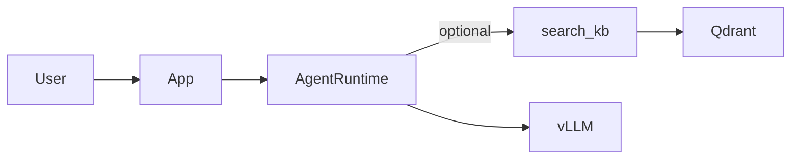

# 01 — Executive Overview

## Название системы

**ea-agent-platform** — self-hosted платформа корпоративного архитектора (EA) с RAG и tool-loop агентом.

## Сводка (один абзац)

Платформа индексирует корпоративные документы (PDF, Office, PPTX, TXT) в Qdrant через Nomic embeddings, предоставляет единого AI-консультанта corporate EA function (промпт «корпоративный архитектор») с on-demand поиском в KB через tool `search_kb`, стриминг-чат по SSE (`POST /chat/agent`) и операционный стек Docker (FastAPI, Postgres, MinIO, Qdrant, vLLM). Backend consolidation (M0–M7) завершена; product UI — минимальный dev panel `/ui`.

## Проблема

- Разрозненные EA-материалы (политики, техрадар, CMDB, презентации) сложно использовать в консультациях.
- Legacy 4-role pipeline (architect/auditor/economist/analyst) — сложный и с pre-RAG.
- Нужен единый консультант с цитированием источников и self-hosted inference.

## Целевые акторы

| Актор | Роль |
|-------|------|
| Бизнес-пользователь EA | Вопросы по архитектуре, политикам, радару |
| Оператор KB | Загрузка документов, запуск ingest |
| Backend/ML engineer | Развитие agent, retrieval, pipeline |
| SRE / ops | Compose, health, smoke |

## Бизнес-цели (реализованные)

1. Единый EA-агент вместо 4 ролей — **Confirmed:** `prompts/corporate_architect.py`, `orchestration/agent_runtime.py`
2. RAG on-demand (не mandatory pre-step) — **Confirmed:** `tools/builtin/search_kb.py`
3. Citations в ответах — **Confirmed:** `retrieval/citations.py`, SSE event `sources`
4. Self-hosted LLM (vLLM Qwen) — **Confirmed:** `llm/vllm_client.py`, `RUNTIME_PROVIDER=vllm`
5. Production-local deploy — **Confirmed:** `docker-compose.yml`, smoke suite

## Технические цели (реализованные)

- Data plane: Nomic + Qdrant + MinIO — M2
- Async ingest queue (Postgres) — M7
- Provider portability (Protocol + env swap) — M7
- SSE streaming UX — M6

## In-scope (AS-IS)

| Capability | Evidence |
|------------|----------|
| Ingest multi-format docs | `ingestion/loaders/text_loader.py` |
| Vector search + citations | `retrieval/similarity_search.py` |
| Agent tool loop | `orchestration/agent_stream.py` |
| SSE chat API | `app/api/main.py::chat_agent` |
| Sync agent API | `POST /tasks/agent` |
| Async ingest jobs | `storage/ingest_jobs.py`, `ingestion/worker.py` |
| Health probes | `/health/live`, `/health/ready`, `/health/llm` |
| Legacy 4-role API (deprecated) | `/tasks/panel`, `/tasks/orchestrate` |

## Out-of-scope (не реализовано)

| Capability | Статус |
|------------|--------|
| Workspaces / multi-tenant UI | Phase 2 P1 |
| Auth / RBAC | Phase 2 P1 |
| Confluence / SQL connectors | Phase 2 P2 — README stubs only |
| MCP, embed widget | Phase 2 P3–P4 |
| Full React product UI | Non-goal |
| BM25 / sparse retrieval | Non-goal в master plan |

## Ключевые метрики (операционный снимок)

- **Chunks в Qdrant:** environment-specific snapshot (see ingestion report in deployment environment)
- **Chunk size:** 220 chars, no overlap — `ingestion/chunking/text_chunker.py`
- **Smoke M0–M7:** PASS

## Архитектурный принцип

RAG **не** выполняется до LLM — только через tool loop.

## Ссылки

- Master plan: internal implementation repository (not published)
- Phase 2: high-level proposals in private planning docs
- Референс UX: `CloneRepo/repos/anything-llm`

## Evidence (ключевые entrypoints)

- `app/api/main.py` — FastAPI app
- `orchestration/agent_stream.py::iter_agent_events`
- `ingestion/pipeline.py::run_ingest_pipeline`
- `docker-compose.yml`
