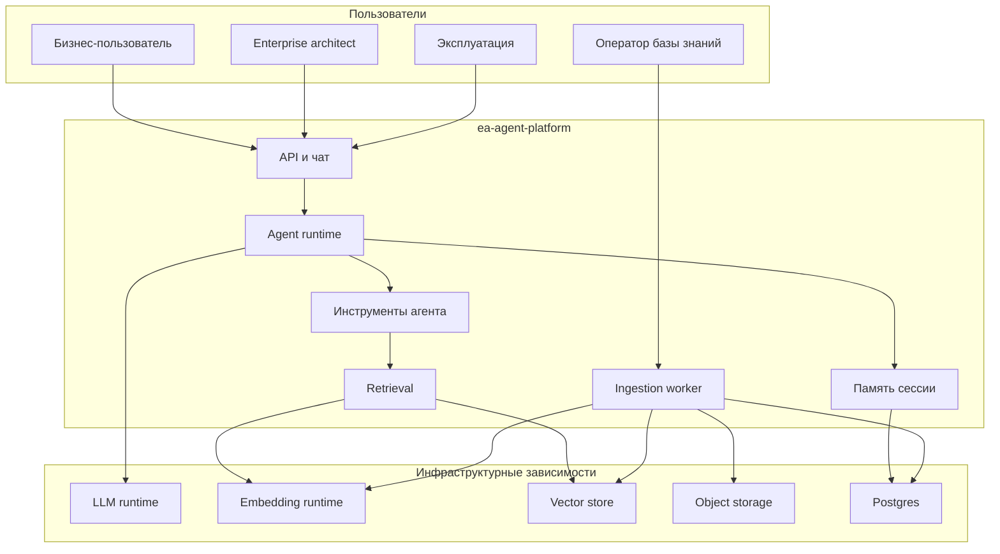
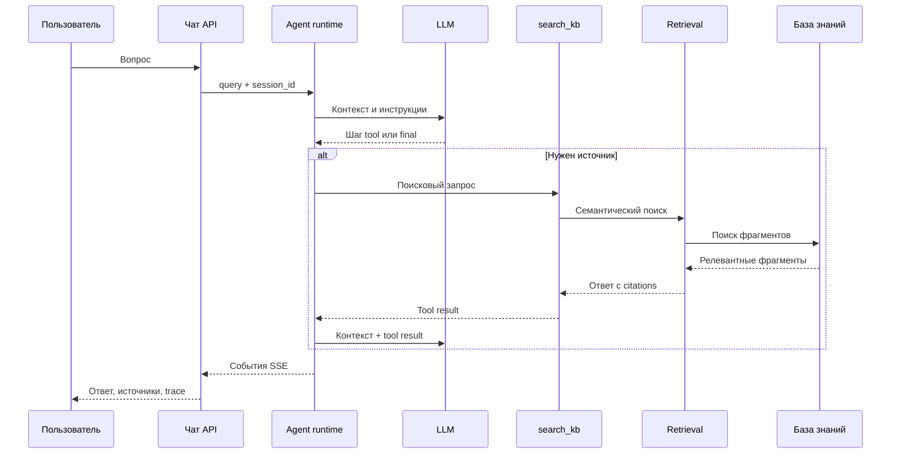
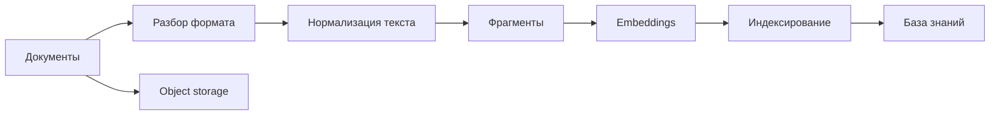

# 03 — System architecture

Этот раздел объясняет платформу как набор связанных контуров управления: диалог, агентное рассуждение, поиск по знаниям, загрузка документов, память и эксплуатационная готовность.

## 1. Контекст системы

## 2. Как читать схему

| Контур | Управленческий смысл |
|--------|----------------------|
| Чат | Единая точка доступа к архитектурной функции. |
| Agent runtime | Контур рассуждения и выбора действия. |
| Tools | Разрешенные способы взаимодействия агента с внешними знаниями и сервисами. |
| Retrieval | Проверяемое извлечение фрагментов из базы знаний. |
| Ingestion | Производственный путь включения новых документов в knowledge base. |
| Memory | Контекст текущего диалога, а не источник истины. |
| Operations | Контроль готовности и деградации зависимостей. |

## 3. Основной поток ответа

Главное архитектурное решение: RAG вызывается **только через инструмент**. Это сохраняет агенту возможность отвечать быстро на общие вопросы и обращаться к базе знаний только тогда, когда требуется обоснование.

## 4. Поток включения документов

Ingestion — это промышленная дисциплина ведения знаний. Если документы не обработаны, агент не сможет использовать их как надежный источник, даже если они “где-то лежат”.

## 5. Слои реализации

| Слой | Назначение | Примеры модулей |
|------|------------|-----------------|
| API | HTTP, SSE, UI shell | `app/api/*` |
| Agent runtime | Tool loop и streaming | `orchestration/*` |
| Tools | Реестр разрешенных действий | `tools/*` |
| Retrieval | Поиск и citations | `retrieval/*` |
| Memory | История диалога | `memory/*` |
| Ingestion | Документы → база знаний | `ingestion/*` |
| LLM / embeddings | Модель ответа и модель смысла | `llm/*`, `embeddings/*` |
| Storage / DB | Jobs, sessions, object storage | `storage/*` |
| Core | Контракты, readiness, protocols | `core/*` |

## 6. Эксплуатационная модель

Архитектура различает:

- **Liveness** — приложение отвечает как процесс.
- **Readiness** — весь контур готов дать качественный ответ: доступны LLM/embeddings, vector store, база данных и storage.

Это важно для эксплуатации: “сервис жив” не означает “агент может дать ответ с источниками”.

## 7. Типовые деградации

| Деградация | Что увидит пользователь | Что проверяет эксплуатация |
|------------|-------------------------|----------------------------|
| LLM недоступна | Ответ не формируется | Health LLM |
| Embeddings недоступны | Поиск по базе знаний деградирует | Embedding runtime |
| Vector store недоступен | Нет релевантных источников | Readiness dependency |
| Postgres недоступен | Проблемы с jobs или session memory | Jobs и memory store |
| Плохой corpus | Ответы слабые, хотя сервис “здоров” | Качество ingestion и документов |

## 8. Достоверность раздела

Материал описывает санитизированную архитектурную картину. Имена модулей оставлены как учебные ориентиры, но без исходного кода, секретов и приватных конфигураций.

Связанные разделы: [Agent runtime](04-agent-runtime.md), [search_kb](06-tools-search_kb.md), [similarity_search](07-retrieval-similarity_search.md).
