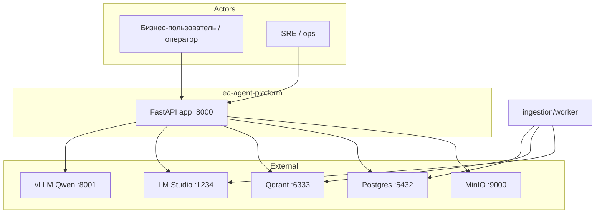
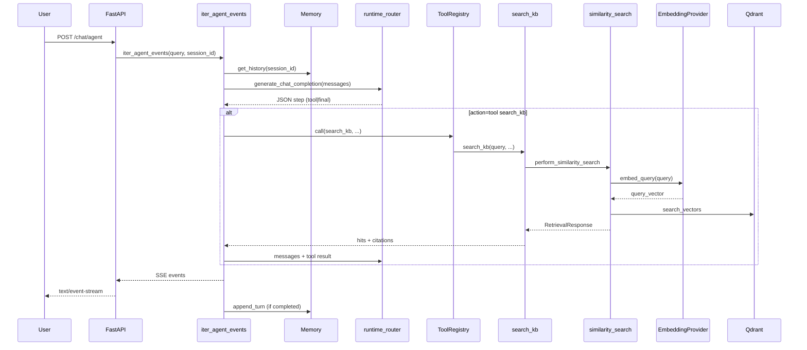
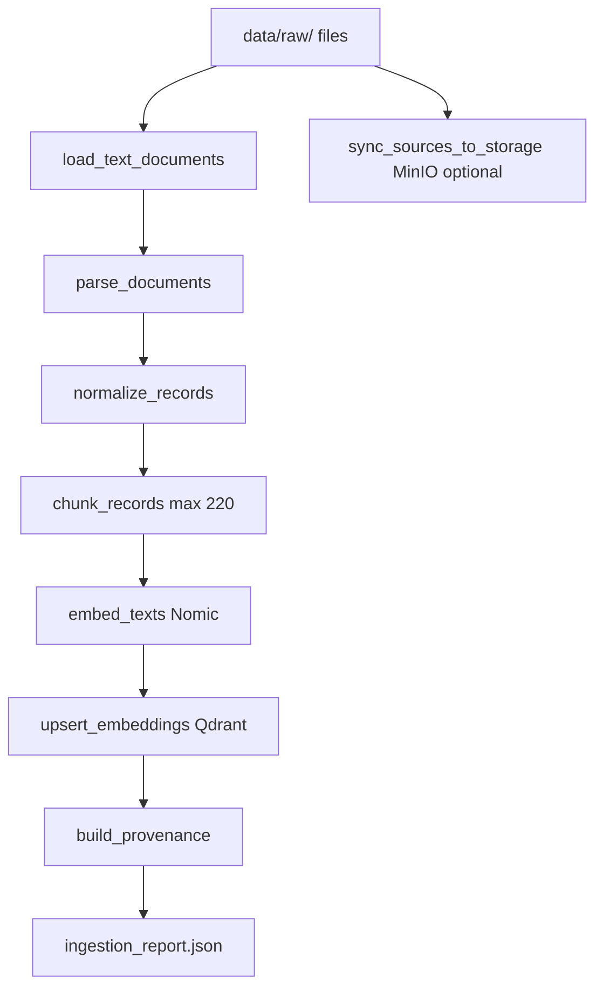
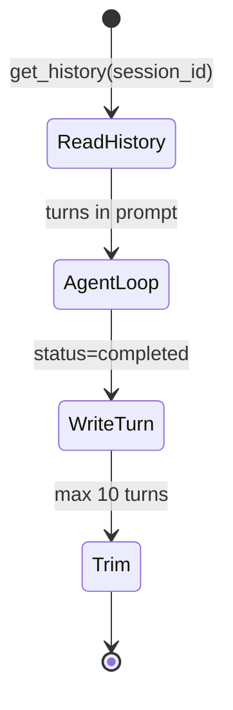

# 03 — System Architecture

## 1. System Context

**Confirmed by code:** `app/api/main.py`, `docker-compose.yml`, `llm/runtime_router.py`, `embeddings/nomic_embeddings.py`.

**Inferred:** vLLM runs outside compose (`<container-host-gateway>:8001` in `environment configuration template`).

## 2. Container / Component Architecture

| Container | Process | Package roots |
|-----------|---------|---------------|
| **API** | `uvicorn app.api.main:app` | `app/`, `orchestration/`, `retrieval/`, `llm/` |
| **Worker** | `python -m ingestion.worker` | `ingestion/`, `storage/` |
| **Periodic worker** | `scripts/run_periodic_ingestion.py` | `ingestion/periodic_ingest.py` |
| **Qdrant** | vector service | `vectorstore/` client |
| **Postgres** | jobs + chat_turns | `storage/postgres_client.py` |
| **MinIO** | object storage | `storage/minio_client.py` |

### Layer map

| Layer | Responsibility | Key modules |
|-------|----------------|-------------|
| API | HTTP, SSE, UI shell | `app/api/main.py`, `app/api/sse.py` |
| Agent runtime | Tool loop, streaming | `orchestration/agent_stream.py`, `agent_runtime.py` |
| Tools | Tool registry, search_kb | `tools/registry.py`, `tools/builtin/search_kb.py` |
| Retrieval | Similarity search, citations | `retrieval/similarity_search.py` |
| Memory | Session history | `memory/short_term.py`, `postgres_store.py` |
| Ingestion | Pipeline + worker | `ingestion/pipeline.py`, `worker.py` |
| LLM | Chat routing | `llm/runtime_router.py` |
| Embeddings | Nomic via LM Studio | `embeddings/nomic_embeddings.py` |
| Vectorstore | Qdrant ops | `vectorstore/qdrant_store.py` |
| Storage | Jobs, MinIO, local FS | `storage/ingest_jobs.py` |
| Core | DTOs, readiness, protocols | `core/contracts.py`, `readiness.py` |

## 3. Runtime Interaction Flows

### 3.1 User query → agent → response

**Evidence:** `orchestration/agent_stream.py`, `tools/builtin/search_kb.py`, `retrieval/similarity_search.py`.

### 3.2 Ingestion pipeline end-to-end

**Evidence:** `ingestion/pipeline.py::run_ingest_pipeline`.

### 3.3 Memory lifecycle

**Evidence:** `memory/short_term.py`, `agent_stream.py` line 171–172.

Postgres path: `memory/postgres_store.py` — table `chat_turns`.

### 3.4 Retrieval flow

See `07-retrieval-similarity_search.md`.

## 4. Deployment View

### docker-compose services

| Service | Image/Build | Ports |
|---------|-------------|-------|
| app | `infra/Dockerfile.app` | 8000 |
| worker | same | — |
| periodic-worker | same | — |
| qdrant | qdrant/qdrant | 6333 |
| postgres | postgres:16-alpine | 5432 |
| minio | minio/minio | 9000, 9001 |

**Evidence:** `docker-compose.yml`.

**Compose `depends_on` (точно по коду):**

| Service | depends_on |
|---------|------------|
| `app` | `postgres` (condition: service_healthy) |
| `worker` | `postgres` (healthy), `qdrant` (service_started) |
| `periodic-worker` | `postgres` (healthy) — **без** qdrant/minio |

vLLM и LM Studio **вне** compose — внешние процессы на host.

### Config groups (env)

| Group | Variables | Module |
|-------|-----------|--------|
| LLM chat | `RUNTIME_PROVIDER`, `VLLM_*`, `LMSTUDIO_*` | `runtime_settings.py`, `llm/` |
| Embeddings | `LMSTUDIO_EMBED_MODEL`, `LMSTUDIO_EMBED_FALLBACK_ENABLED` | `llm/lmstudio_embeddings.py` |
| Qdrant | `QDRANT_*`, `CORPUS_ID_DEFAULT` | `runtime_settings.py` |
| Storage | `STORAGE_PROVIDER`, `MINIO_*` | `storage/providers.py` |
| Postgres | `POSTGRES_*`, `SESSION_STORE` | `storage/postgres_client.py` |
| Agent | `AGENT_MAX_TOOL_CALLS`, `AGENT_MAX_TOKENS` | `runtime_settings.py` |
| Retrieval | `RETRIEVAL_LOCAL_FALLBACK_ENABLED` | `retrieval/vector_retriever.py` |

Helm value profiles (no templates): `infra/helm/ea-agent-platform/values-*.yaml`.

## 5. Failure Modes

| Failure | Behavior | Retry/fallback |
|---------|----------|----------------|
| vLLM down | Agent `status=error`, message in answer | Double `generate()` call only |
| LM Studio embed down | `SimilaritySearchError` on agent path (`search_kb`); local `chunks.json` fallback только в `retrieve_vector` if `RETRIEVAL_LOCAL_FALLBACK_ENABLED=true` | `retrieval/vector_retriever.py:72-75` |
| Qdrant down | Search raises; readiness `degraded` | `core/retry_policy` on vectorstore ping only |
| Postgres down | Async ingest enqueue may JSONL fallback | `storage/ingest_jobs.py` |
| Unknown tool | `{"error": "Unknown tool"}` in loop | Continues loop |
| Duplicate tool call | `ToolCallDeduper` blocks | `tools/dedupe.py` |
| Max tool calls | `status=max_rounds` | `AGENT_MAX_TOOL_CALLS` |
| JSON parse fail | `parse_fallback=True`, raw text as answer | `parsers/agent_response.py` |

### Idempotency

- **Ingest:** full re-upsert; Qdrant point IDs from `chunk_id` UUID5 — **Inferred:** re-ingest updates same points
- **Jobs:** `FOR UPDATE SKIP LOCKED` — `claim_next_ingest_job`
- **No dead-letter queue** — failed jobs stay `failed` in Postgres

## Evidence

- `docker-compose.yml`
- `core/readiness.py`
- `orchestration/agent_stream.py`
- `ingestion/pipeline.py`
- `storage/ingest_jobs.py`
