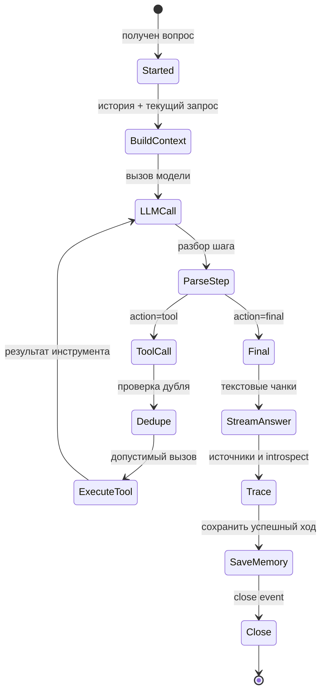

# 04 — Agent runtime

Agent runtime — это управляемый цикл рассуждения агента. Он отделяет “модель умеет генерировать текст” от “платформа умеет дать проверяемый архитектурный ответ”.

## 1. Роль runtime

Runtime отвечает за пять задач:

1. собрать контекст вопроса;
2. вызвать LLM;
3. понять, хочет ли модель дать ответ или вызвать инструмент;
4. выполнить инструмент и вернуть результат обратно в рассуждение;
5. завершить ответ потоковыми событиями и сохранить контекст сессии.

## 2. Жизненный цикл запроса

## 3. Почему нужен tool loop

LLM не должна самостоятельно “угадывать” содержание корпоративных документов. Если ей нужен источник, она вызывает инструмент. Tool loop создает управляемую рамку:

- какие инструменты доступны;
- сколько раз их можно вызывать;
- какие аргументы переданы;
- какие источники получены;
- какой trace останется после ответа.

## 4. События streaming-ответа

| Событие | Что означает |
|---------|--------------|
| `status` | Запрос принят, runtime начал работу. |
| `tool_call` | Агент решил обратиться к инструменту. |
| `sources` | Появились источники, найденные через retrieval. |
| `text` | Очередной фрагмент ответа пользователю. |
| `introspect` | Техническая трасса: tools, аргументы, preview результата. |
| `close` | Поток завершен и итоговый статус известен. |

## 5. Память

Runtime берет историю по `session_id` и добавляет ее в контекст. Это не “долгая память компании”, а краткосрочная память диалога. Она помогает продолжить разговор, но не является источником фактов.

## 6. Guardrails

| Механизм | Зачем нужен |
|----------|-------------|
| JSON step parser | Чтобы модель возвращала структурированное действие: `tool` или `final`. |
| Tool registry | Чтобы агент мог вызвать только зарегистрированные инструменты. |
| Tool dedupe | Чтобы не повторять один и тот же вызов без пользы. |
| Max tool calls | Чтобы цикл не ушел в бесконечное использование инструментов. |
| Citations merge | Чтобы найденные источники дошли до пользователя. |

## 7. Streaming и sync

| Режим | Для чего |
|-------|----------|
| `POST /chat/agent` | Основной пользовательский поток: SSE события и постепенный ответ. |
| `POST /tasks/agent` | Синхронный JSON-ответ для smoke, тестов и интеграции. |

Streaming важен не только для UX. Он показывает жизненный цикл ответа: старт, tool call, sources, текст, trace, завершение.

## 8. Счастливый путь

1. Пользователь спрашивает: “Какие архитектурные политики применимы к этому решению?”
2. Модель решает, что нужен источник.
3. Runtime вызывает `search_kb`.
4. Retrieval возвращает фрагменты и citations.
5. Модель формирует финальный ответ.
6. Пользователь получает текст и источники.

## 9. Деградации

| Сбой | Поведение |
|------|-----------|
| LLM недоступна | Runtime завершает поток ошибкой. |
| Модель вернула неструктурированный текст | Включается parse fallback. |
| Инструмент неизвестен | Runtime возвращает ошибку инструмента в контекст. |
| Повторный одинаковый tool call | Dedupe блокирует повтор. |
| Превышен лимит tool calls | Ответ завершается статусом `max_rounds`. |

## 10. Главное для архитектора

Agent runtime — это место, где AI становится управляемым корпоративным механизмом. Он не только получает ответ от LLM, но и отвечает за дисциплину: источники, ограничения, память, trace и завершение.

Связанные разделы: [search_kb](06-tools-search_kb.md), [Memory](05-memory.md), [API](11-api-and-integration-points.md).
