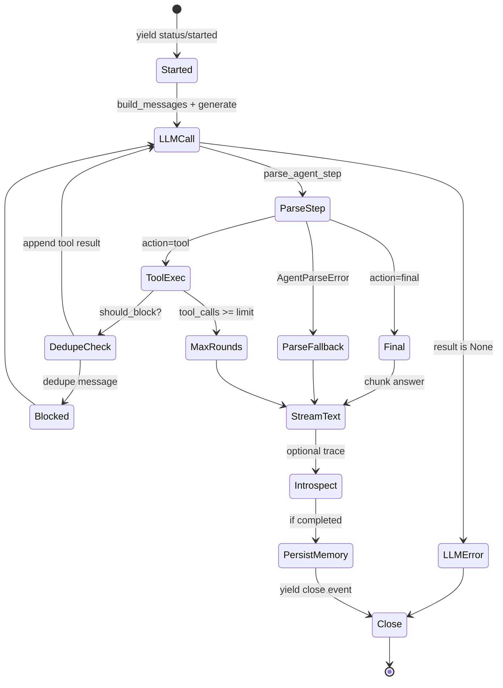
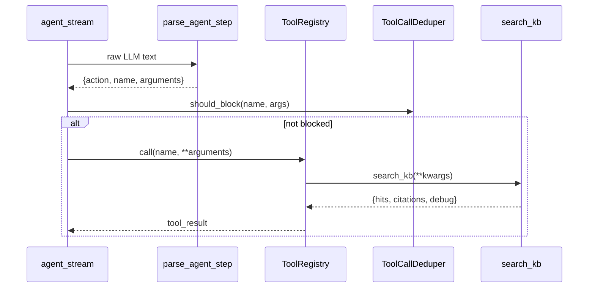

# 04 — Agent Runtime Deep Dive

## Purpose

Agent Runtime — оркестрация **single corporate architect** через JSON tool loop: LLM выбирает `tool` или `final`, tools выполняются синхронно, контекст накапливается в `messages`, результат стримится как SSE.

**Primary modules:**
- `orchestration/agent_stream.py::iter_agent_events` — generator + SSE events
- `orchestration/agent_runtime.py::run_agent` — sync wrapper
- `parsers/agent_response.py::parse_agent_step` — JSON step parser
- `prompts/corporate_architect.py` — system prompt + tool schema

## Request / Session Lifecycle



## State Model

| Variable | Scope | Meaning |
|----------|-------|---------|
| `messages` | Per request | OpenAI-style chat for LLM |
| `trace` | Per request | Tool call audit list |
| `citations` | Per request | Accumulated from tool results |
| `tool_calls` | Per request | Counter of tool invocations |
| `session_id` | Cross-request | Memory key |
| `status` | Per request | `completed`, `error`, `max_rounds` |

**No persistent agent state** beyond memory turns — Confirmed.

## Step Execution Loop (pseudocode)

Reconstructed from `iter_agent_events`:

```
history = memory.get_history(session_id)
messages = [system] + history_as_messages + [user query]
trace, citations, tool_calls = [], [], 0

while tool_calls <= AGENT_MAX_TOOL_CALLS:
    result = llm_generate(messages)  # retry once if None
    if result is None: → status=error, break

    step = parse_agent_step(result.text) OR parse_fallback

    if step.action == "final":
        answer = step.answer; citations merge; break

    if tool_calls >= limit: → max_rounds, break

    if deduper.should_block(tool, args):
        append blocked tool message; tool_calls++; continue

    tool_result = registry.call(tool, **args)
    merge citations from tool_result
    append assistant + tool messages
    tool_calls++

yield text chunks of answer
yield introspect(trace)
if completed: memory.append_turn(session_id, query, answer)
yield close event
```

## Prompt Construction Chain

1. `build_corporate_architect_system_prompt()` — role, `TOOL_SCHEMA`, JSON format rules
2. For each history turn: `build_agent_user_prompt(turn.query)` + assistant answer
3. Current query: `build_agent_user_prompt(query)`

**Evidence:** `agent_stream.py::_build_messages`, `prompts/corporate_architect.py`.

**Tool schema in prompt:** only `search_kb` documented in `TOOL_SCHEMA`.

## Tool Invocation Lifecycle



**Default registry:** `orchestration/agent_runtime.py::_default_registry` registers only `search_kb`.

## Error Handling

| Condition | Handling |
|-----------|----------|
| `AgentParseError` | `parse_fallback=True`, answer=raw text |
| `KeyError` unknown tool | `{"error": "Unknown tool: ..."}` |
| Tool exception | `{"error": str(exc)}` in result |
| LLM None | `status=error`, fixed message |
| Dedupe block | Synthetic tool message, loop continues |

**No circuit breaker** on repeated LLM errors — Confirmed.

## Streaming vs Non-Streaming

| Path | Entry | Output |
|------|-------|--------|
| **Streaming** | `POST /chat/agent` → `iter_agent_events` | SSE: status, tool_call, sources, text chunks, introspect, close |
| **Sync** | `POST /tasks/agent` → `run_agent` | JSON dict: answer, citations, trace, status |

Sync path consumes same generator — `agent_runtime.py::run_agent`.

**Text chunking:** `_chunk_text(answer, 96)` — `agent_stream.py`.

## Guardrails / Validation

- JSON action must be `tool` or `final` — `parse_agent_step`
- `AGENT_MAX_TOOL_CALLS` (default 5) — `runtime_settings.py`
- `AGENT_MAX_TOKENS` passed to vLLM — `runtime_router.py`
- Tool dedupe same name+args — `ToolCallDeduper`
- System prompt rules: when to call / not call `search_kb`

**No content moderation layer** — Needs verification.

## Termination Conditions

| Condition | `status` |
|-----------|----------|
| `action=final` | `completed` |
| Parse fallback | `completed` |
| LLM unavailable | `error` |
| Max tool calls exceeded mid-loop | `max_rounds` |

## Retry Logic

- LLM: **2 attempts** if `generate()` returns `None` — lines 75–77
- Tools: **no retry** — single `registry.call`
- **Unified retry policy** (`core/retry_policy.py`) **not used** in agent loop — Confirmed gap

## Logging / Tracing / Metrics

- `trace` list in response / SSE `introspect`
- `result_preview` truncated to 500 chars per tool call
- **No OpenTelemetry / structured logs** in agent_stream — Confirmed gap

## Interactions

| System | How |
|--------|-----|
| Memory | `get_short_term_memory().get_history/append_turn` |
| Retrieval | Indirect via `search_kb` tool only |
| LLM | `generate_chat_completion` or injected `llm_generate` (tests) |
| Tools | `ToolRegistry.call` |

## Concurrency & Session Isolation

- `ShortTermMemory` uses `threading.Lock` — in-process
- Postgres memory uses per-operation connections + lock
- **Inferred:** same `session_id` on multiple replicas requires `SESSION_STORE=postgres`

## Key Methods Table

| Symbol | File | Responsibility |
|--------|------|----------------|
| `iter_agent_events` | `agent_stream.py` | Main loop + SSE event dicts |
| `run_agent` | `agent_runtime.py` | Sync consumer of events |
| `_default_registry` | `agent_runtime.py` | Register `search_kb` |
| `_build_messages` | `agent_stream.py` | Prompt assembly |
| `parse_agent_step` | `parsers/agent_response.py` | JSON parse + validate action |
| `generate_chat_completion` | `llm/runtime_router.py` | LLM routing |
| `ToolCallDeduper.should_block` | `tools/dedupe.py` | Duplicate tool guard |

## Happy Path Walkthrough

1. User: «Какие политики аудита в базе?»
2. LLM: `{"action":"tool","name":"search_kb","arguments":{"query":"audit policy"}}`
3. SSE: `tool_call`, then `sources` with citations
4. LLM: `{"action":"final","answer":"...","citations":[...]}`
5. SSE: `text` chunks, `introspect`, `close` with `tool_calls=1`

**Test evidence:** `tests/test_agent_runtime.py`, `scripts/smoke_agent_live.ps1`.

## Failure Path Walkthrough

1. vLLM down → double generate fails → `status=error`, answer with ops hint
2. Qdrant down during search_kb → tool_result error or exception in trace
3. LLM returns markdown prose instead of JSON → `parse_fallback`, raw text as answer

## Legacy Runtime (not primary)

`orchestration/orchestrator.py::run_orchestration` — planner + pre-RAG + single role graph.  
`legacy_deprecated: true` в **ответе orchestrator**, не в `/chat/agent`.

**Sync API gap:** `POST /tasks/agent` вызывает `run_agent(payload.query)` без `session_id` — всегда `session_id="default"`. Только `POST /chat/agent` передаёт `ChatAgentRequest.session_id`.

**Do not use** orchestrate/panel for new integrations.

**Evidence:** `orchestration/orchestrator.py`, `app/api/main.py:691-693`, `POST /tasks/orchestrate`.
