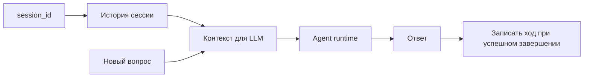

# 05 — Память сессии

Память в агентной системе нужна не для хранения истины, а для сохранения контекста разговора. Это принципиальное отличие: факты должны приходить из корпоративной базы знаний, а память сессии помогает понять, что пользователь имел в виду в продолжении диалога.

## 1. Три разных слоя памяти

| Слой | Назначение | Риск неправильного понимания |
|------|------------|------------------------------|
| UI history | Показать историю пользователю в интерфейсе | Можно принять визуальную историю за серверный контекст. |
| Session memory | Передать последние реплики агенту | Можно принять краткосрочный контекст за источник фактов. |
| Knowledge base | Хранить проверяемые документы и фрагменты | Требует ingestion и governance. |

## 2. Как память участвует в ответе

## 3. Что сохраняется

Сохраняется пара “вопрос пользователя — ответ агента”. Обычно это последние несколько ходов, чтобы не перегружать prompt и не переносить устаревший контекст слишком далеко.

## 4. Почему Postgres важен для масштабирования

In-memory память работает в одном процессе. Если приложение масштабируется на несколько реплик, один и тот же `session_id` должен видеть одну и ту же историю. Для этого используется серверное хранилище, например Postgres.

## 5. Что не делает session memory

- Не индексирует документы.
- Не заменяет retrieval.
- Не гарантирует достоверность фактов.
- Не должна использоваться как audit trail архитектурных решений.

## 6. Практическое правило

Если вопрос требует факта, политики или стандарта — нужен retrieval и citation. Если вопрос продолжает предыдущую мысль — помогает session memory.

## 7. Типовые проблемы

| Симптом | Возможная причина |
|---------|-------------------|
| Агент “не помнит” прошлый вопрос | Изменился `session_id` или память хранится локально. |
| UI показывает историю, но агент отвечает как на новый диалог | UI history не равна server memory. |
| Агент опирается на старый контекст | Сессия слишком длинная или пользователь не начал новый thread. |

## 8. Что запомнить

Память сессии — это удобство диалога. Источником истины остается корпоративная база знаний, доступная через retrieval.
