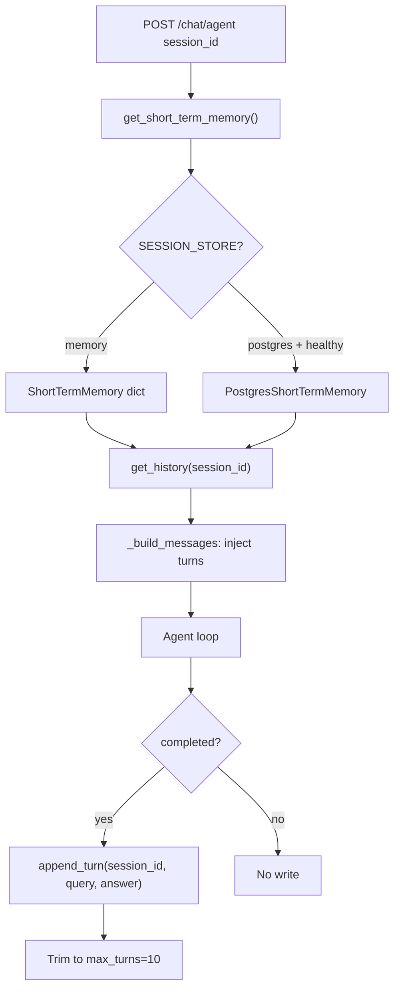

# 05 — Memory

## What «Memory» Means in This Project

В `ea-agent-platform` реализована только **краткосрочная диалоговая память** (conversation history per `session_id`).  
**Нет** в коде: long-term semantic memory, user profile store, vector-backed memory tool, summarization pipeline.

**Confirmed by code:** only `memory/short_term.py`, `memory/postgres_store.py`.

## Memory Types Present

| Type | Implemented | Backend | Module |
|------|-------------|---------|--------|
| Short-term / session | ✅ | In-memory dict OR Postgres | `ShortTermMemory`, `PostgresShortTermMemory` |
| Conversation turns | ✅ | Same | `ChatTurn(query, answer)` |
| Long-term semantic | ❌ | — | Planned Phase 2 / ALLM pattern |
| Cache-like (embed) | ❌ | — | — |
| Agent working memory | ✅ (implicit) | `messages` list in agent loop | `agent_stream.py` |

## Data Structures

### `ChatTurn` (dataclass)

| Field | Type | Meaning |
|-------|------|---------|
| `query` | str | User question text |
| `answer` | str | Final agent answer |

**Location:** `memory/short_term.py::ChatTurn`

### Postgres `chat_turns` table

| Column | Type | Meaning |
|--------|------|---------|
| `session_id` | VARCHAR(128) | Session key |
| `turn_index` | INT | Monotonic per session |
| `query` | TEXT | User message |
| `answer` | TEXT | Assistant message |
| `created_at` | TIMESTAMPTZ | Insert time |

**Schema:** `storage/postgres_client.py` (`_SCHEMA_SQL`)

## Storage Backends

### In-memory (`ShortTermMemory`)

- `_sessions: dict[str, list[ChatTurn]]`
- `max_turns = 10` — sliding window
- `threading.Lock` for thread safety

### Postgres (`PostgresShortTermMemory`)

- Selected when `SESSION_STORE=postgres` AND `ping_postgres() == healthy`
- Same API: `get_history`, `append_turn`, `clear`
- Trim: `DELETE` turns where `turn_index <= last - max_turns`

**Factory:** `memory/short_term.py::get_short_term_memory`

## Policies

### Write policy

- **When:** After agent loop completes with `status=completed` and non-empty `answer`
- **Where:** `agent_stream.py` lines 171–172, `persist_memory=True` default
- **What:** Full query + full answer (no summarization)

### Read policy

- **When:** Start of each `iter_agent_events` call
- **How:** All turns for `session_id`, ordered; injected as pseudo-messages in `_build_messages`

### Retrieval policy

- Memory is **not** retrieved via vector search — only exact session lookup
- **No TTL** on sessions — Confirmed (turns trimmed by count only)

### Summarization / compression

- **Not implemented** — old turns dropped when count > 10

## Memory Lifecycle Diagram



## Call Sites

| Caller | Operation | File |
|--------|-----------|------|
| Agent runtime | read + write | `orchestration/agent_stream.py` |
| UI | `session_id` in localStorage key `ea_agent_session_id_v1` | `app/api/main.py` embedded JS |
| UI | `dialogTurns` display history (localStorage) — **отдельно** от server memory | `main.py:207-271` |

**UI vs server memory (Confirmed):**

- Server memory: `get_short_term_memory()` по `session_id` из `POST /chat/agent`.
- UI `dialogTurns`: локальный localStorage для отображения; кнопка «Очистить историю» вызывает только `clearHistory()` — **не** `PostgresShortTermMemory.clear()` и **не** API.
- Два источника истории могут расходиться.

**No HTTP API** для `memory.clear()` — `PostgresShortTermMemory.clear` и `ShortTermMemory.clear` существуют, но не экспонированы.

## Context Assembly Effect

History turns become:
```
user: build_agent_user_prompt(turn.query)
assistant: turn.answer
```
Then current user query appended.

**Implication:** Tool traces from prior turns are **not** stored — only final answers. **Inferred:** multi-turn tool context is lost between requests.

## Failure Scenarios

| Scenario | Behavior |
|----------|----------|
| Postgres down, `SESSION_STORE=postgres` | Falls back to in-memory — `get_short_term_memory` |
| Postgres down mid-session | **Needs verification:** write may fail if Postgres store already selected |
| Empty session | `get_history` returns `[]` |

## Performance

- In-memory: O(1) append, O(n) history copy
- Postgres: one SELECT + INSERT + DELETE per completed turn
- Max 10 turns limits prompt growth

## Security / Privacy

- **No encryption** at application layer
- Session IDs client-generated (`ui-` + timestamp in UI JS)
- **No auth binding** session to user — Confirmed gap

## Module Responsibility Table

| File | Responsibility |
|------|----------------|
| `memory/short_term.py` | API facade, in-memory store, backend selection |
| `memory/postgres_store.py` | Postgres-backed implementation |
| `storage/postgres_client.py` | Schema, connection, ping |

## Distinction: Memory API vs Storage vs Formatting

| Layer | Module |
|-------|--------|
| Memory API | `get_short_term_memory()`, `ChatTurn` |
| Storage | `ShortTermMemory._sessions` or `chat_turns` table |
| Prompt formatting | `agent_stream.py::_build_messages` |

## Open Points

- **Needs verification:** behavior when Postgres becomes unavailable after `PostgresShortTermMemory` singleton created
- Long-term memory (Qdrant store) mentioned in architecture notes but **not implemented**
