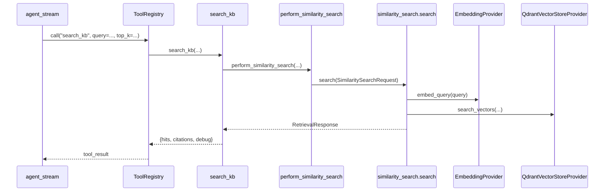

# 06 — Tools: `search_kb`

## Purpose

`search_kb` — единственный production tool агента. On-demand семантический поиск в корпоративной KB (Qdrant), паттерн AnythingLLM `rag-memory`.

**Location:** `tools/builtin/search_kb.py::search_kb`

## Invocation Contract

### Registration

```python
registry.register("search_kb", search_kb)
```

**Evidence:** `orchestration/agent_runtime.py::_default_registry`

### Agent-facing schema (in system prompt)

From `prompts/corporate_architect.py::TOOL_SCHEMA`:

| Parameter | Description |
|-----------|-------------|
| `query` | Строка для семантического поиска |
| `top_k` | Опционально, 1–10 |

LLM invokes via JSON:
```json
{"action":"tool","name":"search_kb","arguments":{"query":"...","top_k":5}}
```

## Input Schema (function parameters)

| Param | Type | Default | Source |
|-------|------|---------|--------|
| `query` | str | required | LLM `arguments` |
| `top_k` | int | 5 | LLM or default |
| `similarity_threshold` | float | 0.25 | function default |
| `corpus_id` | str \| None | `get_default_corpus_id()` | env `CORPUS_ID_DEFAULT` |

**Evidence:** `tools/builtin/search_kb.py`

## Output Schema

```python
{
    "query": str,
    "hits": [
        {
            "text": str,
            "score": float,
            "source_file": str | None,
            "chunk_id": str | None,
        }
    ],
    "citations": [
        {
            "source_uri": str,
            "object_key": str,
            "chunk_id": str,
        }
    ],
    "debug": dict,  # if include_debug=True
}
```

Serialized to JSON string in agent `messages` role `tool`.

## Internal Algorithm

1. `perform_similarity_search(query, corpus_id, top_k, similarity_threshold, include_debug=True)`
2. Map `RetrievalResponse.chunks` → `hits`
3. Map `RetrievalResponse.citations` → citation dicts

**No additional ranking** beyond similarity_search — Confirmed.

## Dependencies

| Dependency | Module |
|------------|--------|
| Similarity search | `retrieval/similarity_search.py` |
| Default corpus | `runtime_settings.get_default_corpus_id` |
| Embeddings | via similarity_search → Nomic/LM Studio |
| Qdrant | via similarity_search → vectorstore |

## Authorization / Validation

- **No tool-level auth** — Confirmed
- Invalid `corpus_id` → empty collection message in retrieval — `empty_retrieval_response`
- Threshold filters low scores in similarity_search, not in search_kb

## Error Handling

| Error | Propagation |
|-------|-------------|
| Qdrant failure | `SimilaritySearchError` from similarity_search → caught in agent_stream → `{"error": ...}` |
| Empty index | Empty hits, debug message |

## Observability

- `debug` block in tool result (latency_ms, raw_hits, filtered_hits)
- Agent `trace` stores `result_preview` (500 chars)
- SSE `sources` event when citations present

## Extension Points

- Register more tools in `ToolRegistry` — `tools/registry.py`
- Update `TOOL_SCHEMA` in `prompts/corporate_architect.py`
- **Needs verification:** LLM not constrained to registered tools only by code — only by prompt

## Runtime Call Chain



## Example (reconstructed from tests)

**Input (tool arguments):**
```json
{"query": "architecture policy", "top_k": 2}
```

**Output (abbreviated):**
```json
{
  "query": "architecture policy",
  "hits": [{"text": "...", "score": 0.72, "source_file": "pilot_policies.txt", "chunk_id": "chk_abc"}],
  "citations": [{"source_uri": "pilot_policies.txt", "object_key": "default/pilot_policies.txt", "chunk_id": "chk_abc"}],
  "debug": {"latency_ms": 45.2, "filtered_hits": 1}
}
```

## Edge Cases

| Case | Behavior |
|------|----------|
| General knowledge question | Prompt says don't call search_kb — **policy in prompt, not enforced in code** |
| Duplicate search_kb same args | `ToolCallDeduper` blocks second call |
| `top_k` > 10 in LLM args | Passed to search — **Needs verification:** Pydantic max is 50 on RetrievalRequest but tool uses direct int |

## Operational Concerns

- Every search_kb call = embed + Qdrant query (latency)
- `include_debug=True` always in search_kb — slightly larger tool payloads

## Open Questions

- Should `similarity_threshold` be exposed to LLM arguments? Currently fixed at tool default 0.25
- Per-workspace thresholds planned P2.5 — not in code yet

## Evidence

- `tools/builtin/search_kb.py`
- `tests/test_agent_runtime.py`
- `scripts/smoke_agent_live.ps1`
