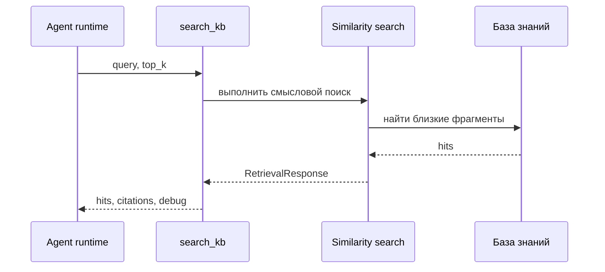

# 06 — Инструмент `search_kb`

`search_kb` — основной инструмент агента для обращения к корпоративной базе знаний. Он связывает рассуждение LLM с проверяемыми источниками.

## 1. Зачем нужен инструмент

Без инструмента агент мог бы ответить только на основе модели и контекста диалога. Для корпоративной архитектуры этого недостаточно: ответ должен быть связан с документами, стандартами, техрадарами или решениями.

`search_kb` решает эту задачу как контролируемый шлюз:

- агент формулирует поисковый запрос;
- retrieval ищет релевантные фрагменты;
- результат возвращается в runtime вместе с citations;
- финальный ответ может ссылаться на источники.

## 2. Место в tool loop

## 3. Контракт вызова

| Параметр | Назначение |
|----------|------------|
| `query` | Текст поискового запроса, сформулированный агентом. |
| `top_k` | Сколько фрагментов запросить. |
| `corpus_id` | Логическая область знаний, если используется изоляция корпусов. |
| `similarity_threshold` | Порог отсечения слабых совпадений. |

Важно: в пользовательский интерфейс не обязательно выносить все параметры. Для C-level ценность не в настройке `top_k`, а в том, что ответ получает проверяемое основание.

## 4. Результат

`search_kb` возвращает:

- найденные фрагменты текста;
- оценки близости;
- идентификаторы источников;
- citations;
- debug-информацию для анализа качества поиска.

## 5. Почему не надо вызывать поиск всегда

RAG on-demand снижает шум. Если пользователь спрашивает общий принцип, агент может ответить без retrieval. Если вопрос требует документа или политики, агент вызывает `search_kb`. Такой подход похож на работу архитектора: не каждый ответ требует открытия архива, но каждый критичный вывод должен иметь источник.

## 6. Ограничения

| Ограничение | Значение |
|-------------|----------|
| Один production tool | Агент пока в основном умеет искать по KB. |
| Нет tool-level auth | Управление доступом должно появиться в product shell. |
| Качество зависит от ingestion | Плохие документы дают слабые hits. |
| Нет reranker в hot path | Результат определяется embeddings + Qdrant + threshold. |

## 7. Расширение

Будущие инструменты могут развивать тот же принцип:

- `read_doc` — прочитать конкретный документ;
- `sql_query` — запросить CMDB или техрадар;
- `web_fetch` — получить внешний или интранет-контекст;
- MCP tools — подключать внешние действия через управляемый интерфейс.

## 8. Важно

`search_kb` — это не “поиск ради поиска”. Это механизм доверия: он дает агенту основание для ответа и оставляет пользователю след, который можно проверить.
