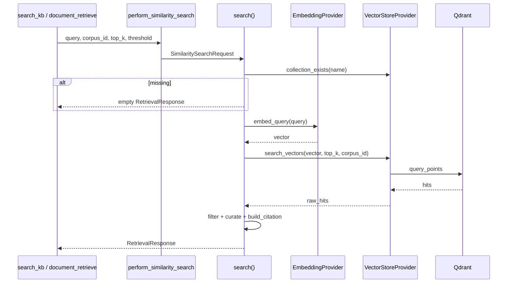

# 07 — Retrieval: `similarity_search`

## Purpose

`similarity_search` — core RAG retrieval: embed query (Nomic) → Qdrant cosine search → threshold filter → curate sources → build `Citation` objects.

**Primary entry:** `retrieval/similarity_search.py::perform_similarity_search`  
**Internal:** `search(SimilaritySearchRequest) -> RetrievalResponse`

Used by: `search_kb` tool, legacy `document_retriever` path.

## Architecture Position


**No BM25** — Confirmed (`plans`, no sparse code path in similarity_search).

## Embeddings / Vector Search

| Step | Implementation |
|------|----------------|
| Query embed | `get_embedding_provider_impl().embed_query` → Nomic prefixes → LM Studio HTTP |
| Collection | `default_collection_name(corpus_id)` → `<vector-collection-name>` or `<vector-collection-name>__{corpus}` |
| Search | `vectorstore.search_vectors` with optional `corpus_id` payload filter |
| Metric | Qdrant cosine (collection created with `Distance.COSINE`) |

**Evidence:** `embeddings/nomic_embeddings.py`, `vectorstore/qdrant_store.py`, `vectorstore/providers.py`.

### Nomic prefixes

| Mode | Prefix |
|------|--------|
| Query | `search_query: ` |
| Document (ingest) | `search_document: ` |

**Evidence:** `embeddings/nomic_embeddings.py`

## Ranking / Filtering

| Filter | Rule | Location |
|--------|------|----------|
| Similarity threshold | `score < threshold` dropped | `similarity_search.py` line 69–71 |
| `filter_identifiers` | Exclude matching `source_identifier` | lines 72–74 |
| `curate_sources` | Dedupe metadata list | `retrieval/citations.py` |
| Top-K | Qdrant `limit=top_k` | before threshold filter |

**No reranker** in hot path — `retrieval/reranker.py` exists but not called from `similarity_search`.

## Chunking Assumptions (ingest side)

Retrieval assumes chunks indexed with payload:
- `chunk_id`, `source_file`, `text`, `corpus_id`, `order`

Chunk creation: `ingestion/chunking/text_chunker.py`, `max_chars=220`, SHA1 id.

**Evidence:** `vectorstore/qdrant_store.py` upsert payload fields.

## Metadata Filtering

- Qdrant filter on `corpus_id` when provided — `search_vectors` in `qdrant_store.py`
- `SimilaritySearchRequest.filters` from parent `RetrievalRequest` — **not applied** in `similarity_search.search` — **Confirmed gap**

## Thresholds / Top-K Defaults

| Parameter | Default | Configurable via |
|-----------|---------|----------------|
| `top_k` | 5 | function arg / tool arg |
| `similarity_threshold` | 0.25 | function arg / `SimilaritySearchRequest` |
| `corpus_id` | `default` | env `CORPUS_ID_DEFAULT` |

## Fallback Logic

| Path | Condition | Behavior |
|------|-----------|----------|
| Empty collection | `collection_exists` false | `empty_retrieval_response` with message |
| Qdrant error | any exception in search | `SimilaritySearchError` raised |
| Local chunks fallback | **Not in similarity_search** | `retrieval/vector_retriever.py` if `RETRIEVAL_LOCAL_FALLBACK_ENABLED=true` |

`search_kb` → `perform_similarity_search` only — **no local fallback** on agent path when env false (prod default).

## Performance Considerations

- Single embed HTTP call per query
- Qdrant query with `top_k` limit
- Debug timing: `latency_ms` in response.debug
- Batch ingest embeds all chunks — separate from query path

## Failure Modes

| Failure | Result |
|---------|--------|
| Collection missing | Empty chunks, debug message |
| Qdrant timeout | `SimilaritySearchError` |
| LM Studio embed down | Exception bubbles to tool error |
| All scores below threshold | Empty hits, citations [] |

## Call Graph

```
perform_similarity_search(query, ...)
  → search(SimilaritySearchRequest)
    → get_vectorstore_provider_impl()
    → get_embedding_provider_impl()
    → vectorstore.collection_exists(target_collection)
    → embedder.embed_query(request.query)
    → vectorstore.search_vectors(...)
    → filter by threshold + filter_identifiers
    → curate_sources(...)
    → build_citation(...) per hit
    → RetrievalResponse
```

## Sequence Diagram



## Citation Contract

`Citation` fields from `core/contracts.py`:
- `source_uri` ← source_file
- `object_key` ← `{corpus_id}/{source_file}`
- `chunk_id`
- `section` optional from payload

**Evidence:** `retrieval/citations.py::build_citation`

## Related Modules (not primary path)

| Module | Role |
|--------|------|
| `document_retriever.py` | Wraps vector retriever for legacy panel |
| `vector_retriever.py` | Optional local `chunks.json` fallback |
| `hybrid_retriever.py` | Alias to document_retrieve |

## Open Questions

- `RetrievalRequest.filters` not wired in similarity_search — intentional or gap?
- Reranker module unused — future or dead code?

## Evidence

- `retrieval/similarity_search.py`
- `tests/test_retrieval_similarity.py`
- `scripts/smoke_retrieval.ps1`
