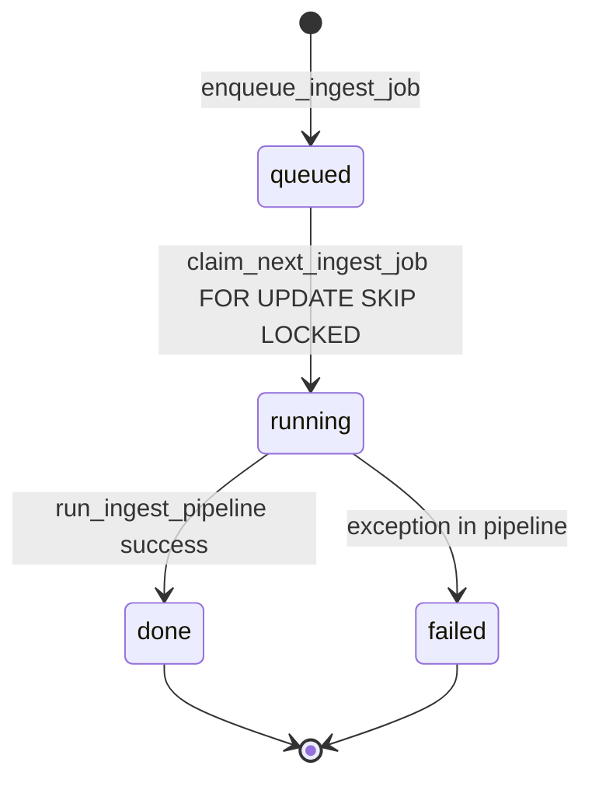
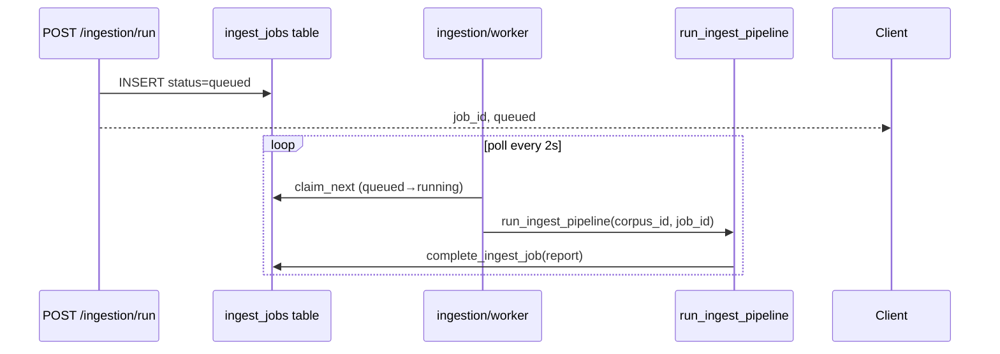

# 08 — Ingestion Worker

## Purpose

`ingestion/worker.py` — long-running consumer Postgres queue `ingest_jobs`: claim → run pipeline → mark `done` or `failed`.

**Entry:** `python -m ingestion.worker` (docker service `worker`).

## Worker Responsibility

| Function | Role |
|----------|------|
| `process_next_job()` | Claim one job, run pipeline, handle errors |
| `run_worker_loop(poll_seconds=2.0)` | Infinite poll loop |
| `main()` | CLI entry |

**Not responsible for:** parsing/chunking logic (delegates to `run_ingest_pipeline`).

## Job Types

**Single job type in code:** full corpus ingest for `corpus_id` from queue row.

| Status flow | Meaning |
|-------------|---------|
| `queued` | Created by `enqueue_ingest_job` |
| `running` | After `claim_next_ingest_job` |
| `done` | `complete_ingest_job` with report JSON |
| `failed` | `fail_ingest_job` with error text |

**Evidence:** `storage/ingest_jobs.py`, Postgres schema in `storage/postgres_client.py`.

## Triggers

| Trigger | Mechanism |
|---------|-----------|
| API async ingest | `POST /ingestion/run` → `enqueue_ingest_job` — `app/api/main.py` |
| Manual enqueue | **Inferred:** only via API or direct DB insert |

**No message broker** (Kafka/RabbitMQ) — Postgres polling only.

## Job Lifecycle





## Retries / Backoff / DLQ

| Feature | Status |
|---------|--------|
| Automatic retry failed jobs | **Not implemented** |
| Backoff | Only `sleep(2)` when queue empty |
| Dead-letter queue | **Not implemented** — status stays `failed` |
| Worker retry on exception | Re-raises after `fail_ingest_job` — **Confirmed:** no auto-requeue |

## Idempotency

- Re-running pipeline re-upserts all chunks from `data/raw/` — full scan
- Qdrant point IDs derived from `chunk_id` UUID5 — **Inferred:** upsert overwrites same ids
- Job row updated in place — no duplicate job prevention for same corpus

## Logging / Monitoring

- **No structured logging** in worker — Confirmed
- Job status via `GET /ingestion/jobs/{job_id}`
- Worker crash: job may stay `running` — **Needs verification:** no stale job recovery

## Interfaces

| Interface | Direction |
|-----------|-----------|
| `claim_next_ingest_job()` | storage → worker |
| `run_ingest_pipeline(corpus_id, job_id)` | worker → pipeline |
| `complete_ingest_job` / `fail_ingest_job` | pipeline/worker → storage |

## Startup Requirements

```python
if ping_postgres().get("status") != "healthy":
    raise RuntimeError("Postgres is required for ingest worker")
ensure_schema()
```

**Evidence:** `ingestion/worker.py::run_worker_loop`

If Postgres unavailable, worker **does not start** — async ingest via API may still enqueue to JSONL fallback when Postgres down (`ingest_jobs.py`).

## Deployment

```yaml
worker:
  command: ["python", "-m", "ingestion.worker"]
  restart: unless-stopped
```

**Evidence:** `docker-compose.yml`

## Operational Concerns

| Concern | Detail |
|---------|--------|
| Single worker process | No horizontal worker scaling in compose |
| Long ingest duration | Blocks worker until pipeline completes |
| Poll interval 2s | Latency to pick new jobs |
| Requires Qdrant + LM Studio | Pipeline dependencies |

## Edge Cases

| Case | Behavior |
|------|----------|
| Empty `data/raw/` | `RuntimeError` in pipeline → `failed` |
| Concurrent API enqueues | Multiple `queued` rows; SKIP LOCKED claims one per worker |
| Worker not running | Jobs stay `queued` indefinitely |

## Open Questions

- Stale `running` jobs after worker crash — **Needs verification**
- Throughput target ≥5 jobs/min (Phase 2 metric) — not measured in code

## Evidence

- `ingestion/worker.py`
- `storage/ingest_jobs.py`
- `scripts/smoke_m7.py` (async ingest smoke)
