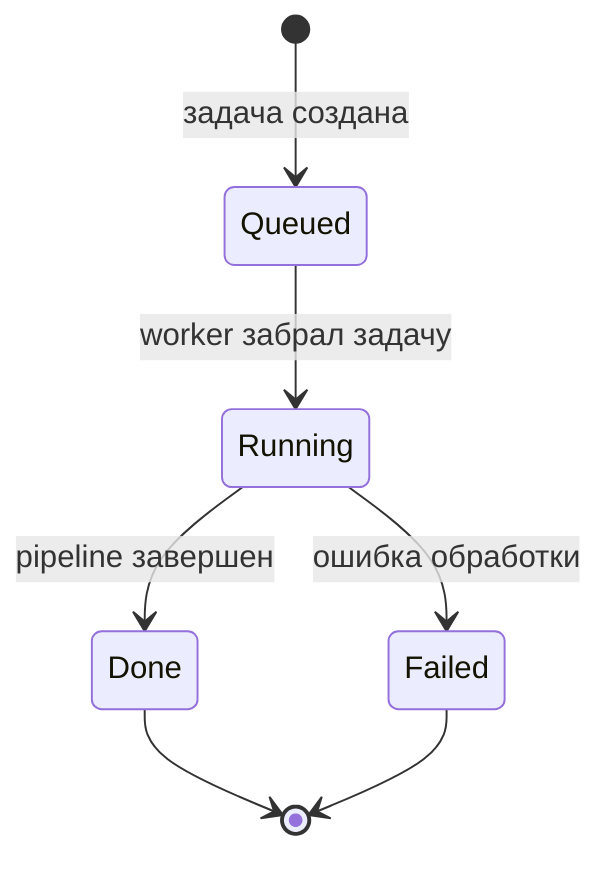

# 08 — Ingestion worker

Ingestion worker выполняет тяжелую часть обновления базы знаний. Пользователь или оператор инициирует задачу, а worker забирает ее из очереди и запускает pipeline.

## 1. Зачем нужен worker

Обработка документов может занимать время: нужно извлечь текст, построить embeddings и обновить vector store. Если делать это синхронно в пользовательском запросе, интерфейс будет зависать. Worker отделяет “принять задачу” от “выполнить обработку”.

## 2. Жизненный цикл задания

## 3. Значение статусов

| Статус | Смысл для оператора |
|--------|---------------------|
| `queued` | Задача принята, но еще не обрабатывается. |
| `running` | Worker выполняет ingestion pipeline. |
| `done` | База знаний обновлена. |
| `failed` | Нужно смотреть ошибку, источник данных и зависимости. |

## 4. Управленческий смысл

Очередь делает обновление знаний наблюдаемым процессом. Можно понять:

- какие задачи ждут обработки;
- какие выполняются;
- какие завершились ошибкой;
- сколько времени занимает обновление базы знаний;
- какие документы требуют повторной обработки.

## 5. Типовые причины `failed`

| Причина | Что проверить |
|---------|---------------|
| Нет parseable документов | Содержимое источника документов. |
| Недоступны embeddings | Состояние embedding runtime. |
| Недоступен vector store | Readiness и сетевые зависимости. |
| Ошибка формата | Логи pipeline и список skipped sources. |

## 6. Что пока требует развития

- Автоматическое восстановление stale `running` jobs.
- Dead-letter queue.
- Приоритеты заданий.
- Инкрементальный ingest.
- UI для оператора базы знаний.

## 7. Важно

Worker — это не просто background process. Это элемент промышленной дисциплины: знания обновляются через очередь, имеют статус и могут быть диагностированы.
