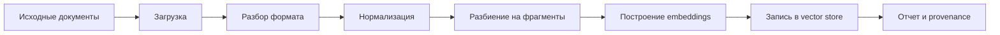

# 09 — Ingestion pipeline

Ingestion pipeline — это контур превращения документов в знания, которыми может пользоваться агент. Если retrieval отвечает за поиск, то ingestion отвечает за качество материала, по которому этот поиск выполняется.

## 1. Зачем нужен pipeline

Корпоративные документы приходят в разных форматах, с разной структурой и качеством. LLM не должна каждый раз “читать файлы с диска”. Вместо этого документы заранее переводятся в форму, пригодную для поиска.

## 2. Основные этапы

## 3. Что происходит на каждом этапе

| Этап | Смысл |
|------|-------|
| Загрузка | Найти документы, которые должны попасть в контур знаний. |
| Разбор | Извлечь текст из PDF, Office-файлов и других поддержанных форматов. |
| Нормализация | Привести текст к единому виду. |
| Chunking | Разделить длинный документ на фрагменты, которые можно искать. |
| Embeddings | Превратить текст в числовое представление смысла. |
| Upsert | Обновить vector store без дублирования точек. |
| Provenance | Зафиксировать, что было обработано и откуда пришли данные. |

## 4. Почему chunking важен

Если фрагмент слишком большой, retrieval вернет лишний контекст. Если слишком маленький — потеряется смысл. Поэтому chunking — это не техническая деталь, а настройка качества архитектурного ответа.

## 5. Связь с MinIO и локальным источником

Санитизированная архитектура допускает object storage как системный контур хранения, но ingestion должен иметь понятный read-path. Важно различать:

- где лежит исходный документ;
- где хранится его копия;
- какие фрагменты индексируются;
- какой `chunk_id` потом попадет в citation.

## 6. Что получает пользователь

Пользователь не видит pipeline напрямую. Он видит результат: агент начинает находить новые документы и цитировать их в ответах. Поэтому для бизнеса ingestion выглядит как “обновили знания системы”.

## 7. Риски качества

| Риск | Последствие |
|------|-------------|
| Документ плохо распарсен | В базе знаний появится неполный или шумный текст. |
| Документ устарел | Агент может ссылаться на неактуальный источник. |
| Нет provenance | Нельзя понять, откуда появился фрагмент. |
| Нет delta-ingest | Полная переобработка может быть дороже, чем нужно. |

## 8. Что запомнить

Ingestion — это governance корпоративной базы знаний. Без него агентная система превращается в красивый интерфейс поверх неуправляемых файлов.
