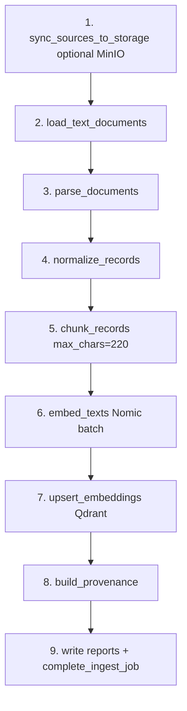

# 09 — Ingestion Pipeline

## Purpose

`ingestion/pipeline.py::run_ingest_pipeline` — синхронный ETL: read `data/raw/` → parse → chunk → embed → Qdrant upsert → artifacts on disk + job completion.

## End-to-End Stages

## Stage Details

### 1. Source acquisition

| Aspect | Implementation |
|--------|----------------|
| Read path | `get_raw_documents_dir()` → `data/raw/` |
| MinIO sync | `sync_sources_to_storage` if `sync_minio=True` |
| Provider | `get_storage_provider_impl()` — local or minio |

**Confirmed:** ingest reads local FS, not MinIO for parsing.

### 2. Load (`ingestion/loaders/text_loader.py`)

- Multi-format: pdf, xlsx, docx, pptx, csv, html, yaml, parquet, etc.
- Returns `LoadedDocument` list + `skipped_sources`

### 3. Parse (`ingestion/parsers/text_parser.py`)

- `parse_documents(loaded)` → list of `(source_file, text)` tuples

### 4. Normalize (`ingestion/normalizers/text_normalizer.py`)

- `normalize_records(parsed)` — text cleanup

### 5. Chunk (`ingestion/chunking/text_chunker.py`)

| Parameter | Value |
|-----------|-------|
| `max_chars` | 220 (default) |
| Overlap | None |
| `chunk_id` | `chk_` + SHA1(`source_file:order:text`)[:12] |

Unit: each normalized record line/paragraph after loader split.

### 6. Embed (`embeddings/providers.py`)

- `embedder.embed_texts(chunk_texts)` — batch all chunks
- Nomic `search_document:` prefix per chunk

### 7. Index (`vectorstore/providers.py`)

- `vectorstore.upsert_embeddings(chunks, vectors, corpus_id)`
- Batch upsert 100 points — `qdrant_store.py`
- Returns count of points written

### 8. Provenance (`ingestion/provenance/provenance_builder.py`)

- `build_provenance(normalized_records)` → JSON file

### 9. Status / artifacts

| Artifact | Path |
|----------|------|
| `seed_documents.txt` | `data/seed_documents.txt` |
| `chunks.json` | `data/chunks.json` |
| `ingestion_report.json` | `data/ingestion_report.json` |
| `provenance_records.json` | `data/provenance_records.json` |
| `ingestion_skipped.json` | `data/ingestion_skipped.json` |

## Report Schema (dict returned)

| Field | Meaning |
|-------|---------|
| `timestamp_utc` | ISO timestamp |
| `corpus_id` | Target corpus |
| `documents_indexed` | Count of text lines collected |
| `sources_scanned` | Loaded file count |
| `chunks_count` | Chunk count |
| `qdrant_points_upserted` | Upsert count |
| `storage_provider` | `local` or `minio` |
| `storage_synced` | MinIO upload list |
| `job_id` | From queue or `record_ingest_job` |

**Evidence:** `ingestion/pipeline.py` lines 75–98.

## Orchestration Boundaries

| Caller | Mode |
|--------|------|
| `ingestion/run_ingest.py` | Sync CLI |
| `ingestion/worker.py` | Async with `job_id` |
| `ingestion/periodic_ingest.py` | Copies inbox → raw, then pipeline |
| `POST /ingestion/run` | API enqueue or sync |

## Reprocessing / Updates

- **Full re-ingest** each run — no checksum/delta skip in pipeline
- **Inferred:** unchanged files re-embedded and re-upserted (idempotent point ids)

## Failure Behavior

- No parseable docs → `RuntimeError("No parseable source documents...")`
- Embed/Qdrant failure → exception propagates to worker → `failed` job
- Partial file skip → recorded in `skipped_sources`

## Bottlenecks & Scaling

| Bottleneck | Notes |
|------------|-------|
| Embed batch | All chunk texts in one `embed_texts` call — **Needs verification:** LM Studio batch limits |
| Qdrant upsert | Batches of 100 |
| Single-threaded pipeline | No parallel file processing |
| Large PPTX/PDF | Memory proportional to extracted text |

## Periodic Ingest (`ingestion/periodic_ingest.py`)

- `run_periodic_once()` → `_sync_inbox_to_raw()` → `run_ingest()` → `run_ingest_pipeline()`
- Inbox → raw: только файлы с расширениями `.pptx`, `.pdf`, `.csv`, `.xlsx`, `.xls`, `.docx` (`TRACKED_EXTENSIONS`)
- Копирование при изменении `mtime` (state в `data/periodic_state.json`)
- `scripts/run_periodic_ingestion.py` — loop 300s (`run_periodic_loop(interval_seconds=300)`)
- Compose `periodic-worker` depends_on только postgres — **без** qdrant

**Needs verification:** periodic-worker restart loop (ingest может fail без qdrant healthy wait).

## Key Functions

| Symbol | Responsibility |
|--------|----------------|
| `run_ingest_pipeline` | Full pipeline orchestration |
| `sync_sources_to_storage` | Storage provider sync |
| `load_text_documents` | Multi-format load |
| `chunk_records` | Fixed-size chunking |
| `complete_ingest_job` | Mark async job done |

## Tests

- `tests/test_ingestion_pipeline.py`
- `tests/test_ingestion_multiformat_loader.py`
- `scripts/smoke_ingest.py`

## Open Questions

- Semantic chunking in `IngestRequest.chunkers` — DTO exists, **not implemented** in pipeline
- `force_reindex` in `IngestRequest` — **not read** by pipeline — Confirmed gap

## Evidence

- `ingestion/pipeline.py`
- `ingestion/chunking/text_chunker.py`
- `ingestion/loaders/text_loader.py`
