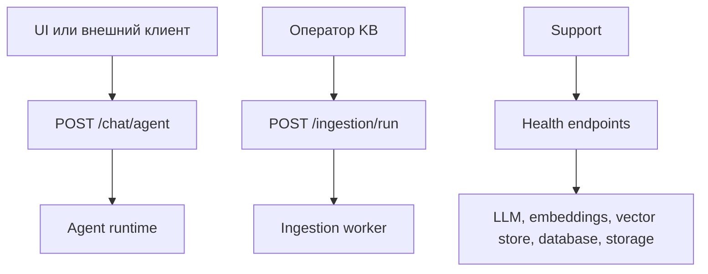

# 11 — API и интеграционные точки

API платформы отражает основные контуры системы: пользовательский чат, обновление базы знаний и эксплуатационная диагностика.

## 1. Основные группы API

| Группа | Назначение |
|--------|------------|
| Chat | Получить ответ агента. |
| Ingestion | Обновить корпоративную базу знаний. |
| Health | Проверить готовность системы и зависимостей. |
| Legacy | Совместимость со старым контуром, не основной путь. |

## 2. Chat API

`POST /chat/agent` — основной пользовательский endpoint. Он возвращает Server-Sent Events, чтобы пользователь видел ход формирования ответа.

| Событие | Что показывает |
|---------|----------------|
| `status` | Старт обработки. |
| `tool_call` | Агент обратился к инструменту. |
| `sources` | Найдены источники. |
| `text` | Фрагмент ответа. |
| `introspect` | Trace для диагностики. |
| `close` | Итоговый статус. |

## 3. Ingestion API

| Endpoint | Смысл |
|----------|-------|
| `POST /ingestion/run` | Создать задачу обновления базы знаний. |
| `GET /ingestion/jobs/{job_id}` | Получить статус обработки. |

Для бизнес-пользователя это будущая основа document management UI. Для эксплуатации — точка контроля, где видно, зависла ли обработка.

## 4. Health API

| Endpoint | Вопрос, на который отвечает |
|----------|-----------------------------|
| `GET /health/live` | Приложение как процесс живо? |
| `GET /health/ready` | Система готова дать качественный ответ? |
| `GET /health/llm` | Доступны ли runtime LLM и embeddings? |

Важно: readiness может быть `degraded`, даже если HTTP-ответ успешный. Это нормальный design: endpoint должен быть доступен, чтобы объяснить, какая зависимость деградировала.

## 5. Legacy API

Старые endpoint могут оставаться для совместимости, но primary path — `POST /chat/agent`. Legacy-контуры могут использовать pre-RAG и давать отличающиеся результаты.

## 6. Интеграционная логика

## 7. Важно

API платформы разделяет пользовательский поток, поток обновления знаний и эксплуатационный поток. Это важно: один и тот же сервис должен быть удобен пользователю, оператору базы знаний и support-команде.
