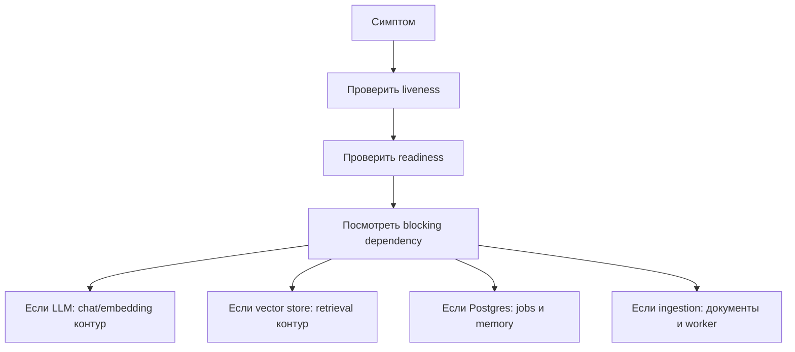

# 12 — Эксплуатация, наблюдаемость и риски

Агентная система состоит из нескольких зависимостей. Поэтому эксплуатация должна отвечать не только на вопрос “приложение запущено?”, но и на вопрос “может ли пользователь получить качественный ответ с источниками?”.

## 1. Уровни здоровья

| Уровень | Что проверяет | Управленческий смысл |
|---------|---------------|----------------------|
| Liveness | Процесс приложения отвечает | Сервис не умер. |
| Readiness | Доступны ключевые зависимости | Сервис готов к пользовательскому сценарию. |
| LLM health | Доступна модель ответа и embeddings | Агент может рассуждать и искать знания. |
| Ingestion jobs | Обновляется ли база знаний | Корпоративная память поддерживается в актуальном состоянии. |

## 2. Основные зависимости

| Зависимость | Роль | Что будет при деградации |
|-------------|------|--------------------------|
| LLM runtime | Формирует рассуждение и ответ | Ответ не будет сформирован. |
| Embedding runtime | Строит смысловые представления | Retrieval и ingestion деградируют. |
| Vector store | Хранит фрагменты и embeddings | Агент не найдет источники. |
| Postgres | Jobs и session memory | Нарушится очередь и общая память. |
| Object storage | Хранение исходных документов | Сложнее управлять источниками. |

## 3. Наблюдаемость ответа

| Механизм | Что дает |
|----------|----------|
| SSE `tool_call` | Видно, что агент обратился к инструменту. |
| SSE `sources` | Видно, какие источники найдены. |
| SSE `introspect` | Видно trace для диагностики. |
| Job status | Видно состояние ingestion. |
| Readiness `blocking` | Видно, какая зависимость мешает готовности. |

## 4. Риск-регистр

| Риск | Влияние | Митигирующее действие |
|------|---------|-----------------------|
| Нет auth/RBAC | Нельзя безопасно расширять аудиторию | Реализовать product shell с ролями. |
| Устаревший corpus | Ответы могут быть формально корректны, но управленчески неверны | Ввести владельца базы знаний и регламент ingestion. |
| Недоступны embeddings | Поиск и ingestion не работают | Мониторить readiness и LLM health. |
| Недоступен vector store | Нет ответов с источниками | Alert по readiness dependency. |
| Jobs зависают | Документы не попадают в базу знаний | Нужен recovery stale jobs. |
| Нет workspace-изоляции | Возможна путаница областей знаний | Развивать workspaces и RBAC. |

## 5. Операционный сценарий диагностики

## 6. Важно

Хорошая эксплуатация агентной системы — это контроль качества ответа, а не только контроль процесса. Система может быть “живой”, но не готовой дать проверяемый архитектурный ответ.
