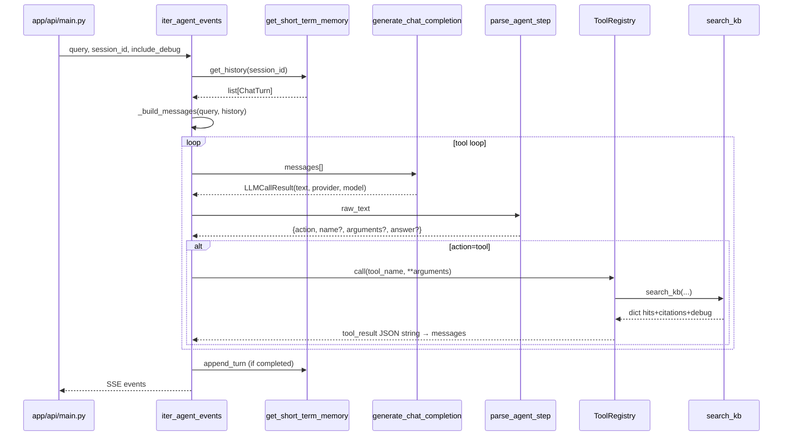
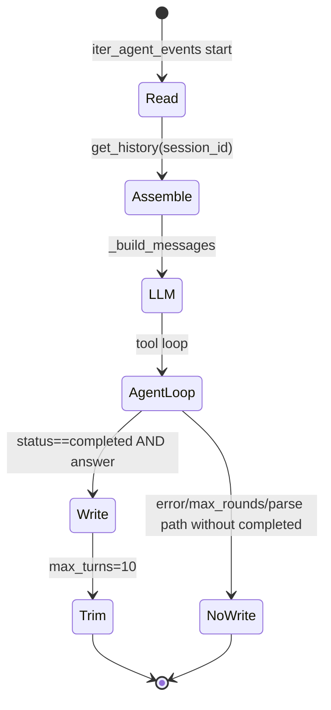
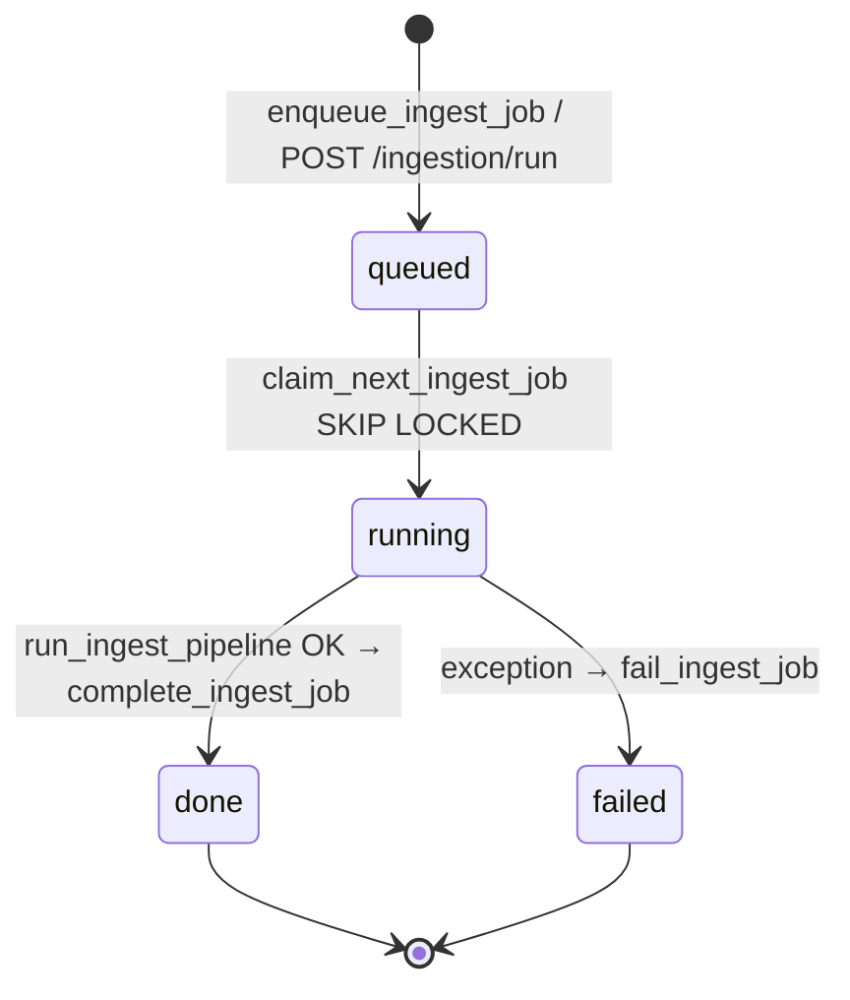
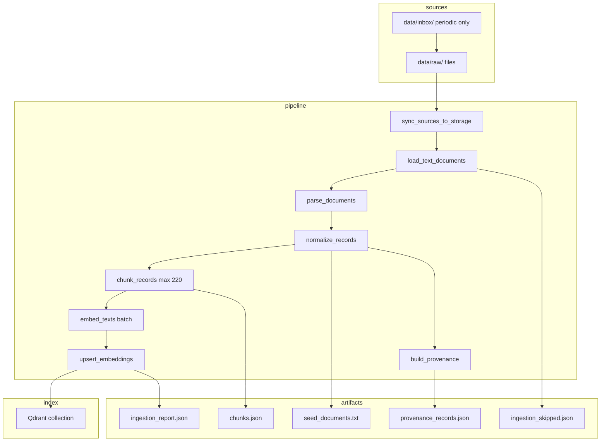
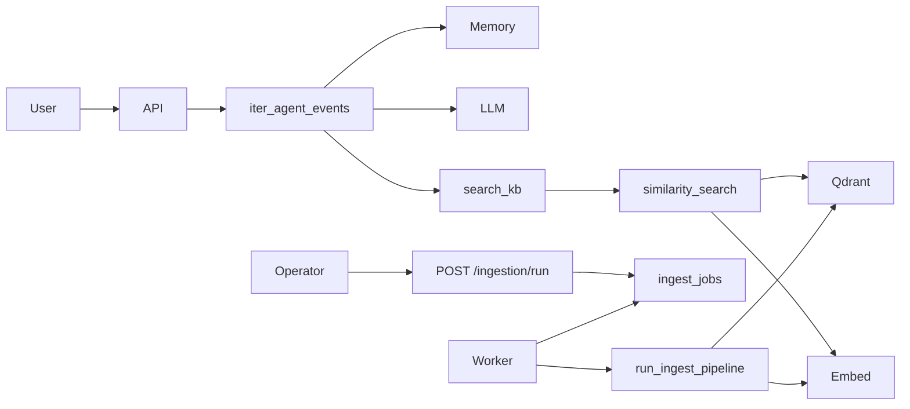

# 14 — Deep Dive: приоритетные области

Консолидированный технический разбор шести критических путей выполнения.  
Дата: `2026-06-07`. Метод: reverse-engineering из кода `ea-agent-platform`.

**Связанные документы:** [04-agent-runtime](04-agent-runtime.md), [05-memory](05-memory.md), [06-tools-search_kb](06-tools-search_kb.md), [07-retrieval-similarity_search](07-retrieval-similarity_search.md), [08-ingestion-worker](08-ingestion-worker.md), [09-ingestion-pipeline](09-ingestion-pipeline.md).

---

## 1. Agent Runtime — orchestration и execution loop

### Что делает

Оркестрирует multi-turn tool loop **без mandatory pre-RAG**: LLM (corporate architect) сам выбирает вызов `search_kb` или финальный ответ. Единый генератор событий — `iter_agent_events`; sync-обёртка — `run_agent`.

### Entrypoints

| Entrypoint | Тип | Путь к коду |
|------------|-----|-------------|
| `POST /chat/agent` | SSE HTTP | `app/api/main.py::chat_agent` |
| `POST /tasks/agent` | Sync JSON | `app/api/main.py::agent_task` |
| `run_agent()` | Library / tests | `orchestration/agent_runtime.py` |
| `iter_agent_events()` | Iterator | `orchestration/agent_stream.py` |

### Main classes / functions

| Symbol | Файл | Ответственность |
|--------|------|-----------------|
| `iter_agent_events` | `orchestration/agent_stream.py` | Главный execution loop, yield SSE-событий |
| `run_agent` | `orchestration/agent_runtime.py` | Сбор `close` + `trace` из iterator |
| `_default_registry` | `orchestration/agent_runtime.py` | Регистрация `search_kb` |
| `_build_messages` | `orchestration/agent_stream.py` | system + history + user prompt |
| `parse_agent_step` | `parsers/agent_response.py` | JSON step → `tool` \| `final` |
| `generate_chat_completion` | `llm/runtime_router.py` | Routing vLLM / LM Studio |
| `build_corporate_architect_system_prompt` | `prompts/corporate_architect.py` | System prompt + TOOL_SCHEMA |
| `ToolRegistry.call` | `tools/registry.py` | Диспетчеризация tool handler |
| `ToolCallDeduper` | `tools/dedupe.py` | Блокировка дубликатов tool call |
| `format_sse` | `app/api/sse.py` | `event:` / `data:` framing |

### Execution loop (pseudocode из кода)

```text
history = memory.get_history(session_id)
messages = [system_prompt] + flatten(history) + [user_prompt(query)]
trace, citations, tool_calls = [], [], 0
yield status:started

WHILE tool_calls <= AGENT_MAX_TOOL_CALLS:
    result = generate(messages)  # retry once if None
    IF result is None → status=error, break

    TRY step = parse_agent_step(result.text)
    EXCEPT AgentParseError → answer=raw_text, parse_fallback=True, break

    IF step.action == "final" → answer, citations, break

    IF deduper.should_block(tool, args):
        append tool-role blocked message; tool_calls++; continue

    yield tool_call
    TRY tool_result = registry.call(tool, **args)
    EXCEPT → tool_result = {error: ...}

    merge citations; yield sources (if any)
    append assistant + tool messages to messages
    tool_calls++

FOR chunk in _chunk_text(answer, 96): yield text
IF include_debug: yield introspect(trace)
IF completed: memory.append_turn(session_id, query, answer)
yield close(status, answer, citations, ...)
```

### Data между слоями



| Layer transition | Payload |
|------------------|---------|
| HTTP → Stream | `ChatAgentRequest`: `query`, `session_id`, `include_debug` |
| Stream → Memory (read) | `session_id` → `list[ChatTurn{query, answer}]` |
| Stream → LLM | `list[{role, content}]` — roles: system, user, assistant, tool |
| LLM → Parse | `str` (ожидается JSON `{"action":"tool"|"final",...}`) |
| Stream → ToolRegistry | `tool_name`, `arguments` dict |
| Tool → Stream | JSON-serialized dict в role `tool` |
| Stream → Memory (write) | `session_id`, `query`, `answer` (только `status==completed`) |
| Stream → Client | SSE: `status`, `tool_call`, `sources`, `text`, `introspect`, `close` |

### Error paths

| Условие | `status` | Поведение |
|---------|----------|-----------|
| `generate()` → `None` (×2) | `error` | `answer` = сообщение про `/health/llm` |
| `AgentParseError` | `completed` | `parse_fallback=True`, `answer` = сырой текст LLM |
| `action=final` | `completed` | Нормальное завершение |
| `tool_calls >= limit` до вызова | `max_rounds` | «Agent stopped: tool loop limit reached» |
| `KeyError` unknown tool | loop continues | `tool_result = {error: Unknown tool}` |
| Exception в tool | loop continues | `tool_result = {error: str(exc)}` |
| Dedupe block | loop continues | synthetic tool message, `introspect` event |

**Важно:** HTTP 200 даже при `status=error` в SSE `close` — ошибка на уровне события, не HTTP.

### Observability / logging

| Механизм | Где |
|----------|-----|
| SSE `introspect` | `trace[]` с `tool_call`, `dedupe_blocked`, `max_tool_calls_reached` |
| SSE `tool_call` | realtime tool name + arguments |
| SSE `close` | `provider`, `model`, `tool_calls`, `parse_fallback` |
| Structured logging | **Не реализован** в runtime |
| Metrics | **Не реализован** |

Тесты: `tests/test_chat_agent_stream.py`, `scripts/smoke_chat_agent.py`, `scripts/smoke_agent_live.py`.

### Extension points

| Точка | Как расширить |
|-------|---------------|
| `registry` param | Передать custom `ToolRegistry` с новыми `register()` |
| `llm_generate` param | Mock / alternate LLM в тестах |
| `max_tool_calls` | Override лимита |
| `persist_memory=False` | Отключить write в memory |
| `prompts/corporate_architect.py` | Новые tools в `TOOL_SCHEMA` + register в `_default_registry` |
| `parsers/agent_response.py` | Новые `action` types (требует изменения loop) |

### Evidence

- `orchestration/agent_stream.py`
- `orchestration/agent_runtime.py`
- `parsers/agent_response.py`
- `llm/runtime_router.py`
- `prompts/corporate_architect.py`

---

## 2. Memory — read/write lifecycle и context assembly

### Что означает «memory» в проекте

Только **short-term session memory** — история пар user/assistant для multi-turn chat. Нет long-term semantic memory, нет отдельного vector memory layer.

### Entrypoints

| Entrypoint | Вызов |
|------------|-------|
| `iter_agent_events` | `get_short_term_memory()` → read/write |
| `get_short_term_memory()` | Factory: in-memory или Postgres |

Прямого HTTP API для memory **нет**.

### Main classes / functions

| Symbol | Файл | Ответственность |
|--------|------|-----------------|
| `ChatTurn` | `memory/short_term.py` | dataclass `query`, `answer` |
| `ShortTermMemory` | `memory/short_term.py` | In-process dict + Lock |
| `PostgresShortTermMemory` | `memory/postgres_store.py` | Postgres `chat_turns` |
| `get_short_term_memory` | `memory/short_term.py` | Factory по `SESSION_STORE` |
| `get_session_store` | `runtime_settings.py` | `memory` \| `postgres` |

### Lifecycle



### Context assembly (`_build_messages`)

```text
messages = [
  {role: system, content: build_corporate_architect_system_prompt()},
  FOR each turn in history:
    {role: user, content: build_agent_user_prompt(turn.query)},
    {role: assistant, content: turn.answer},
  {role: user, content: build_agent_user_prompt(current_query)},
]
```

**Политика:** полные тексты прошлых ответов в контекст — без summarization. Trim только по количеству turns (10), не по токенам.

### Read / write policies

| Операция | In-memory | Postgres |
|----------|-----------|----------|
| Read | `list()` copy под Lock | `SELECT ... ORDER BY turn_index` |
| Write | append + slice `[-max_turns:]` | INSERT + DELETE old indices |
| Trim | `max_turns=10` | DELETE WHERE `turn_index <= next - max_turns` |
| Clear | `clear(session_id)` | DELETE all for session |
| Write gate | только `status==completed` | same |

**Assumption / Needs verification:** failed runs не записываются — confirmed в `agent_stream.py:171`.

### Data между слоями

| From → To | Data |
|-----------|------|
| Memory → Stream | `list[ChatTurn]` |
| Stream → Prompt builder | `turn.query` per turn |
| Stream → Memory | `session_id`, `query`, `answer` |
| Postgres row | `(session_id, turn_index, query, answer, created_at)` |

### Error paths

| Сценарий | Поведение |
|----------|-----------|
| `SESSION_STORE=postgres`, Postgres down | Fallback на in-memory `_default_memory` |
| Postgres write fail | Exception propagates — **Needs verification** in multi-replica |
| Empty session | `get_history` → `[]` |

### Observability

- Memory не эмитит события
- `close.session_id` в SSE — косвенная трассировка сессии
- Нет audit log turns

### Extension points

| Точка | Расширение |
|-------|------------|
| `ShortTermMemory.max_turns` | Увеличить history window |
| New store backend | Implement same interface + extend `get_short_term_memory` |
| Summarization | Insert между `get_history` и `_build_messages` — **not present** |
| `persist_memory=False` | Skip write in tests |

### Evidence

- `memory/short_term.py`
- `memory/postgres_store.py`
- `storage/postgres_client.py` (schema `chat_turns`)

---

## 3. Tool execution path — `search_kb`

### Entrypoints

| Entrypoint | Chain |
|------------|-------|
| Agent loop | `ToolRegistry.call("search_kb", **args)` |
| Direct (tests) | `tools/builtin/search_kb.py::search_kb` |

Единственный зарегистрированный builtin tool в `_default_registry`.

### Main functions

| Symbol | Файл | Role |
|--------|------|------|
| `search_kb` | `tools/builtin/search_kb.py` | Tool handler |
| `perform_similarity_search` | `retrieval/similarity_search.py` | Delegates to `search()` |
| `ToolRegistry.register/call` | `tools/registry.py` | Dispatch |
| `ToolCallDeduper` | `tools/dedupe.py` | Per-run dedupe |

### Invocation contract

**Input (LLM → tool):**

```json
{"action":"tool","name":"search_kb","arguments":{"query":"...","top_k":5}}
```

`corpus_id`, `similarity_threshold` — поддерживаются в `search_kb()` signature, но **не в TOOL_SCHEMA** prompt — LLM обычно не передаёт.

**Output (tool → LLM):**

```json
{
  "query": "...",
  "hits": [{"text","score","source_file","chunk_id"}],
  "citations": [{"source_uri","object_key","chunk_id"}],
  "debug": { "latency_ms", "raw_hits", "filtered_hits", ... }
}
```

### Call chain

```mermaid
sequenceDiagram
    participant Loop as iter_agent_events
    participant Reg as ToolRegistry
    participant SK as search_kb
    participant SS as perform_similarity_search
    participant Emb as EmbeddingProvider
    participant VS as VectorStoreProvider

    Loop->>Reg: call("search_kb", query=...)
    Reg->>SK: search_kb(query, top_k, threshold, corpus_id)
    SK->>SS: perform_similarity_search(...)
    SS->>Emb: embed_query(query)
    Emb-->>SS: float[]
    SS->>VS: search_vectors(vector, top_k, corpus_id)
    VS-->>SS: raw_hits[]
    SS->>SS: filter threshold, curate_sources, build_citation
    SS-->>SK: RetrievalResponse
    SK-->>Reg: dict
    Reg-->>Loop: dict → json.dumps → messages[tool]
```

### Data между слоями

| Step | Type |
|------|------|
| arguments | `dict` from LLM JSON |
| `RetrievalResponse` | Pydantic: `chunks`, `citations`, `debug` |
| Tool dict | Plain dict for JSON serialization |
| Citations merge | Stream accumulates unique citation dicts for SSE `sources` |

### Error paths

| Error | Handling |
|-------|----------|
| `SimilaritySearchError` (Qdrant/embed fail) | Exception → `tool_result = {error: ...}` in loop |
| Empty collection | `empty_retrieval_response` — не exception |
| Unknown tool | `KeyError` → `{error: Unknown tool}` |

### Observability

| Signal | Location |
|--------|----------|
| SSE `tool_call` | tool name + arguments |
| SSE `sources` | merged citations |
| `trace[].result_preview` | first 500 chars of tool JSON |
| `debug.latency_ms` | inside tool_result (if `include_debug=True`) |

### Extension points

| Point | Action |
|-------|--------|
| `_default_registry()` | `registry.register("new_tool", handler)` |
| `TOOL_SCHEMA` in prompt | Document new tool for LLM |
| `search_kb` params | Extend signature + prompt schema |
| Authorization per corpus | **Not implemented** — add before `perform_similarity_search` |

### Evidence

- `tools/builtin/search_kb.py`
- `tools/registry.py`
- `orchestration/agent_runtime.py::_default_registry`

---

## 4. Retrieval flow — `similarity_search`

### Entrypoints

| Entrypoint | Path |
|------------|------|
| `search_kb` tool | `perform_similarity_search()` |
| Direct API/tests | `retrieval/similarity_search.py::search(request)` |
| Smoke | `scripts/smoke_retrieval.py` |

**Нет** публичного `POST /retrieval/search` в `main.py` — **Confirmed**.

### Main functions

| Symbol | File | Role |
|--------|------|------|
| `perform_similarity_search` | `similarity_search.py` | Convenience wrapper |
| `search` | `similarity_search.py` | Core algorithm |
| `SimilaritySearchError` | `similarity_search.py` | Qdrant/embed failure |
| `empty_retrieval_response` | `retrieval/contracts.py` | Empty corpus |
| `curate_sources` | `retrieval/citations.py` | Metadata extraction |
| `build_citation` | `retrieval/citations.py` | `Citation` DTO |
| `source_identifier` | `retrieval/citations.py` | Dedup key |
| `upsert_embeddings` / `search_vectors` | `vectorstore/qdrant_store.py` | Qdrant I/O |
| `get_embedding_provider_impl` | `embeddings/providers.py` | Nomic/LM Studio |

### Algorithm

```text
request = SimilaritySearchRequest(...)
target_collection = default_collection_name(corpus_id)

IF NOT collection_exists → empty_retrieval_response

query_vector = embedder.embed_query(query)
raw_hits = vectorstore.search_vectors(vector, top_k, corpus_id filter)

filtered = [hit WHERE score >= threshold AND NOT in filter_identifiers]
curated = curate_sources(filtered)
FOR hit, metadata: build RetrievedChunk + Citation

RETURN RetrievalResponse + debug{latency_ms, raw_hits, filtered_hits, items}
```

### Data между слоями

```mermaid
flowchart LR
    Q[str query] --> R[SimilaritySearchRequest]
    R --> E[embed_query → float[]]
    E --> V[search_vectors → raw_hits]
    V --> F[threshold filter]
    F --> C[curate_sources]
    C --> B[build_citation]
    B --> RR[RetrievalResponse]
```

| Qdrant payload (from ingest) | Field |
|------------------------------|-------|
| Point payload | `chunk_id`, `corpus_id`, `source_file`, `order`, `text` |
| Point ID | `uuid5(NAMESPACE_URL, chunk_id)` |
| Search filter | `corpus_id == request.corpus_id` |

### Parameters (defaults)

| Param | Default | Env override |
|-------|---------|--------------|
| `top_k` | 5 | tool arg |
| `similarity_threshold` | 0.25 | tool arg |
| `corpus_id` | `CORPUS_ID_DEFAULT` | `get_default_corpus_id()` |
| `filter_identifiers` | `[]` | DTO only |
| `agent_scope`, `filters` in `RetrievalRequest` | — | **Ignored** in search |

### Error paths

| Condition | Result |
|-----------|--------|
| Collection missing | Empty response, message in debug |
| Embed/Qdrant exception | `SimilaritySearchError` raised |
| All hits below threshold | Empty `chunks`, debug shows `filtered_hits=0` |
| `RETRIEVAL_LOCAL_FALLBACK_ENABLED` | **Not used** in `similarity_search.py` — **Confirmed gap** |

### Observability

| Field | Source |
|-------|--------|
| `debug.latency_ms` | `time.perf_counter()` in `search()` |
| `debug.raw_hits` / `filtered_hits` | post-filter counts |
| `debug.items` | per-hit preview |

No dedicated log lines — debug only when `include_debug=True`.

### Extension points

| Point | Extension |
|-------|-----------|
| `get_vectorstore_provider_impl()` | New vector backend via factory |
| `get_embedding_provider_impl()` | New embedder |
| `search()` post-filter | Add reranker, hybrid BM25 |
| `SimilaritySearchRequest` | Wire `filters` to Qdrant Filter |
| Public REST endpoint | Add in `main.py` wrapping `perform_similarity_search` |

### Evidence

- `retrieval/similarity_search.py`
- `retrieval/citations.py`
- `vectorstore/qdrant_store.py`
- `retrieval/contracts.py`

---

## 5. Async/background — `ingestion/worker`

### Entrypoints

| Entrypoint | Trigger |
|------------|---------|
| Docker `ea-worker` | `python -m ingestion.worker` |
| `ingestion/worker.py::main` | CLI |
| `process_next_job()` | Single job (tests) |

Enqueue side (не worker):

| Entrypoint | Function |
|------------|----------|
| `POST /ingestion/run` | `enqueue_ingest_job(corpus_id)` |
| Sync fallback | `run_ingest()` inline in API process |

### Main functions

| Symbol | File | Role |
|--------|------|------|
| `run_worker_loop` | `ingestion/worker.py` | Infinite poll loop |
| `process_next_job` | `ingestion/worker.py` | Claim + pipeline + fail |
| `claim_next_ingest_job` | `storage/ingest_jobs.py` | `FOR UPDATE SKIP LOCKED` |
| `complete_ingest_job` | `storage/ingest_jobs.py` | status=done + report JSONB |
| `fail_ingest_job` | `storage/ingest_jobs.py` | status=failed + error |
| `enqueue_ingest_job` | `storage/ingest_jobs.py` | status=queued |

### Job lifecycle



### Worker loop pseudocode

```text
IF postgres not healthy → RuntimeError (worker refuses start)
ensure_schema()
LOOP forever:
    job = claim_next_ingest_job()
    IF job is None:
        sleep(poll_seconds=2.0)
        CONTINUE
    TRY:
        run_ingest_pipeline(corpus_id=job.corpus_id, job_id=job.job_id)
    EXCEPT:
        fail_ingest_job(job_id, str(exc))
        RAISE  # worker process may crash — Needs verification compose restart policy
```

### Data между слоями

| Transition | Payload |
|------------|---------|
| API → Queue | `job_id` UUID, `corpus_id`, `status=queued` |
| Claim | `{job_id, corpus_id}` |
| Pipeline success | full `report` dict → JSONB |
| `GET /ingestion/jobs/{id}` | serialized job row |

### Error paths

| Scenario | Behavior |
|----------|----------|
| Postgres down at worker start | `RuntimeError` — worker exits |
| Pipeline `RuntimeError` (no docs) | `failed` + exception re-raised |
| Postgres down at enqueue | JSONL fallback append — **worker won't process** |
| No automatic retry | Failed job stays `failed` |
| Multi-worker | `SKIP LOCKED` allows parallel consumers |

### Observability

| Signal | Present? |
|--------|----------|
| Python logging in worker | Minimal — no structured job logs in code |
| Job status API | `GET /ingestion/jobs/{job_id}` |
| `ingest_jobs.jsonl` | Fallback audit file |
| Metrics (queue depth) | **Not implemented** |

### Extension points

| Point | Extension |
|-------|-----------|
| `poll_seconds` | Parametrize `run_worker_loop` |
| Retry policy | Wrap `process_next_job` with re-queue |
| Dead-letter queue | New status + table column |
| Job types | Extend `ingest_jobs` schema beyond full pipeline |
| Non-Postgres queue | Redis/SQS consumer replacing poll |

### Evidence

- `ingestion/worker.py`
- `storage/ingest_jobs.py`
- `app/api/main.py::ingestion_run`

---

## 6. End-to-end — `ingestion/pipeline`

### Entrypoints

| Entrypoint | Path |
|------------|------|
| Worker | `run_ingest_pipeline(job_id=...)` |
| Sync API | `ingestion/run_ingest.py::run_ingest` |
| CLI | `python -m ingestion.run_ingest` |
| Periodic | `ingestion/periodic_ingest.py` |

### Main functions

| Symbol | File | Stage |
|--------|------|-------|
| `run_ingest_pipeline` | `ingestion/pipeline.py` | Orchestrator |
| `sync_sources_to_storage` | `ingestion/pipeline.py` | Optional MinIO sync |
| `load_text_documents` | `ingestion/loaders/text_loader.py` | Multi-format load |
| `parse_documents` | `ingestion/parsers/text_parser.py` | Extract text |
| `normalize_records` | `ingestion/normalizers/text_normalizer.py` | Cleanup |
| `chunk_records` | `ingestion/chunking/text_chunker.py` | 220-char slices |
| `embed_texts` | embeddings provider | Batch vectors |
| `upsert_embeddings` | vectorstore provider | Qdrant upsert |
| `build_provenance` | `ingestion/provenance/provenance_builder.py` | Provenance JSON |
| `complete_ingest_job` | `storage/ingest_jobs.py` | Job completion |

### End-to-end data flow



### Data shapes per stage

| Stage | Input | Output |
|-------|-------|--------|
| Load | `Path` dir | `LoadedDocument[]`, `skipped_sources[]` |
| Parse | loaded docs | `list[(source_file, text)]` |
| Normalize | parsed | same tuple shape, cleaned text |
| Chunk | normalized | `list[{chunk_id, source_file, order, text}]` |
| Embed | `chunk_texts[]` | `list[list[float]]` same length |
| Upsert | chunks + vectors | int count; Qdrant points |
| Report | aggregates | dict with counts, paths, `job_id` |

**Chunk ID:** `chk_` + SHA1(`source_file:order:text`)[:12].

### Error paths

| Condition | Behavior |
|-----------|----------|
| `collected` empty after normalize | `RuntimeError` — no parseable docs |
| `len(chunks) != len(vectors)` | `ValueError` in upsert |
| Partial file skip | in `skipped_sources`, pipeline continues |
| Embed failure | Exception → worker `failed` |
| Qdrant down | Exception → worker `failed` |

### Idempotency

- Re-run re-embeds all chunks
- Same `chunk_id` → same Qdrant point ID (`uuid5`) → upsert overwrites
- **No** file-hash skip — full reprocess every run

### Observability

| Artifact / signal | Content |
|-------------------|---------|
| `ingestion_report.json` | timestamp, counts, paths, storage sync |
| `ingestion_skipped.json` | failed/skipped files |
| Job `report` JSONB | same as report dict |
| Pipeline logging | **Minimal** — no per-stage timers in code |

### Extension points

| Point | Extension |
|-------|-----------|
| `chunk_records(max_chars=...)` | Semantic chunking |
| `load_text_documents` | New format handlers |
| `sync_minio=False` | Skip object storage |
| `raw_dir` param | Custom source path |
| Pre-upsert delta | File checksum index — **not present** |
| `IngestRequest.chunkers` | **DTO not wired** |

### Evidence

- `ingestion/pipeline.py`
- `ingestion/chunking/text_chunker.py`
- `ingestion/loaders/text_loader.py`
- `vectorstore/qdrant_store.py::upsert_embeddings`

---

## Cross-area interaction map



**Критический путь запроса:** User → `/chat/agent` → memory read → LLM → (optional) `search_kb` → Qdrant → tool result → LLM → memory write.

**Критический путь индексации:** Operator → enqueue → worker → `data/raw` → embed → Qdrant → report.

---

## Summary table: observability gaps (all areas)

| Area | Present | Missing |
|------|---------|---------|
| Agent runtime | SSE trace, introspect | structured logs, metrics |
| Memory | implicit session_id | turn audit, metrics |
| search_kb | debug in tool_result | dedicated spans |
| similarity_search | debug.latency_ms | logs, fallback hook |
| worker | job status API | queue metrics, job logs |
| pipeline | report JSON files | per-stage timing |
