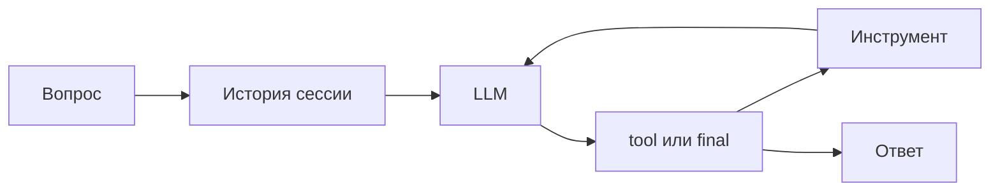
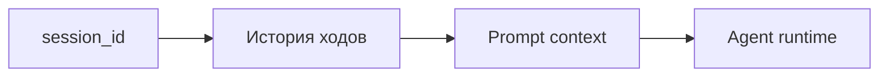
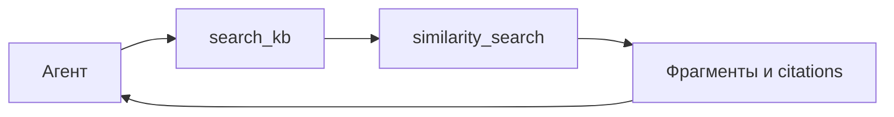
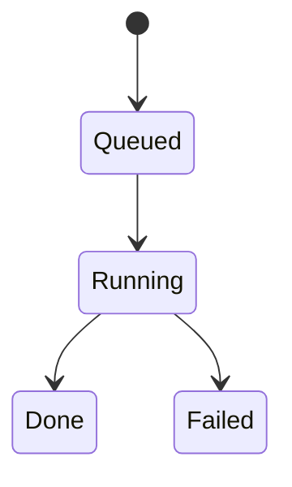
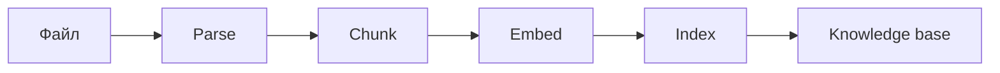
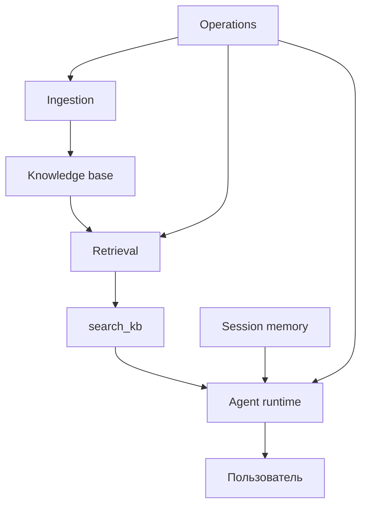

# 14 — Deep dive: шесть критических контуров

Этот документ предназначен для углубленного разбора системы. Он не заменяет архитектурные разделы, а показывает, какие execution paths особенно важны для понимания и эксплуатации.

## 1. Agent runtime

**Вопрос:** как пользовательский запрос превращается в ответ?

Контур:

Что важно:

- агент не обязан искать по базе знаний на каждый вопрос;
- tool loop ограничивает и трассирует действия агента;
- финальный ответ стримится пользователю событиями SSE;
- trace нужен для диагностики, а не для бизнес-пользователя.

## 2. Memory

**Вопрос:** что агент помнит между репликами?

Контур:

Что важно:

- session memory помогает продолжать разговор;
- UI history и server memory не одно и то же;
- память сессии не является источником истины;
- для масштабирования нужен общий store.

## 3. `search_kb`

**Вопрос:** как агент получает факты из базы знаний?

Контур:

Что важно:

- `search_kb` — production tool для RAG on-demand;
- результат инструмента возвращается обратно в рассуждение агента;
- citations должны доходить до пользователя;
- будущие tools должны следовать тому же принципу управляемости.

## 4. Similarity search

**Вопрос:** как выбираются релевантные фрагменты?

Контур:

Что важно:

- поиск семантический, а не keyword-only;
- threshold влияет на баланс точности и полноты;
- качество поиска зависит от ingestion;
- corpus/workspace isolation — следующий продуктовый шаг.

## 5. Ingestion worker

**Вопрос:** как задача обновления знаний становится выполненной работой?

Контур:

Что важно:

- очередь отделяет UI от тяжелой обработки;
- статус job — главный интерфейс оператора;
- stale jobs и retry policy требуют эксплуатационного внимания;
- качество базы знаний начинается не в retrieval, а в ingestion.

## 6. Ingestion pipeline

**Вопрос:** как файл превращается в searchable knowledge?

Контур:

Что важно:

- документ должен быть корректно разобран;
- chunk size влияет на качество retrieval;
- embeddings должны быть доступны и стабильны;
- provenance нужен для доверия к источникам.

## Итоговая логика

Все шесть контуров работают вместе:

Если один контур деградирует, качество ответа может снизиться, даже если остальные компоненты формально работают.
