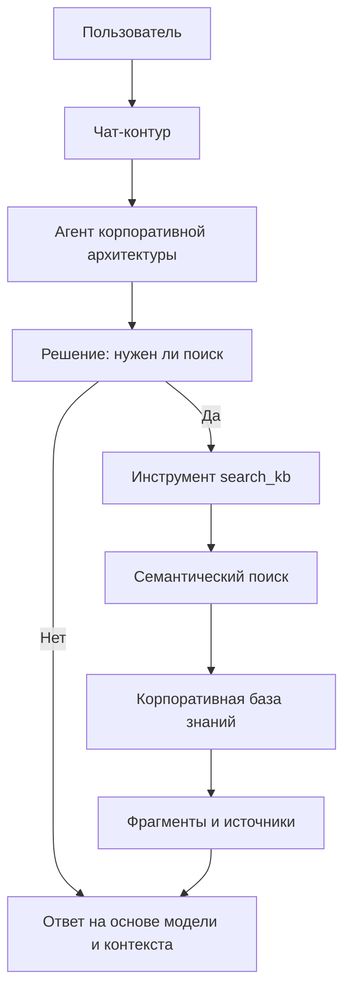

# Архитектурная шпаргалка

Эта страница — быстрый конспект платформы. Ее удобно открыть перед чтением детальных разделов или использовать как “карту разговора” на архитектурном комитете.

## Одной фразой

`ea-agent-platform` — это self-hosted агент корпоративной архитектуры: он принимает вопрос пользователя, при необходимости ищет подтверждения в корпоративной базе знаний и возвращает ответ с пояснениями, источниками и технической трассой.

## Главный принцип

RAG не является обязательным предварительным шагом. Агент сначала оценивает вопрос и только затем решает, нужен ли поиск по базе знаний через `search_kb`.

## Слои системы

| Слой | Роль в архитектурном контуре |
|------|------------------------------|
| Чат-интерфейс | Точка входа пользователя и потоковая выдача ответа |
| Agent runtime | Управляет диалогом, вызовом инструментов и финальным ответом |
| Prompt builder | Задает роль корпоративного архитектора и формат рассуждения |
| LLM adapter | Изолирует платформу от конкретного inference runtime |
| Tools | Дают агенту управляемые действия, например `search_kb` |
| Retrieval | Находит релевантные знания в Qdrant по embeddings |
| Memory | Хранит контекст диалога, но не заменяет корпоративную базу знаний |
| Ingestion | Превращает документы в searchable knowledge |
| Operations | Показывает готовность системы к работе и деградации зависимостей |

## Что важно для C-level

- Платформа повышает скорость архитектурного анализа, потому что знания доступны через диалог.
- Ответы становятся проверяемыми: citations показывают, откуда взят контекст.
- Единый агент снижает риск разрозненных трактовок архитектурных правил.
- Контур ingestion делает базу знаний управляемой, а не ручной подборкой файлов.

## Что важно для архитектора

- `corpus_id` задает логическую область знаний.
- `search_kb` — контролируемый вход в RAG-контур.
- `similarity_search` возвращает не “документ целиком”, а релевантные фрагменты.
- Качество ответа зависит от качества исходных документов, chunking и embeddings.

## Что важно для эксплуатации

- `/health/live` отвечает на вопрос “жив ли сервис”.
- `/health/ready` отвечает на вопрос “готов ли контур отвечать пользователю”.
- Ingestion выполняется через очередь заданий.
- Деградация embeddings или Qdrant влияет на ответы с источниками сильнее, чем на сам чат.

## Куда читать дальше

- [Маршруты чтения](reading-paths.md)
- [Глоссарий](glossary.md)
- [System architecture](../architecture/system-architecture.md)
- [Agent runtime](../runtime/agent-runtime.md)
- [Troubleshooting map](troubleshooting-map.md)
