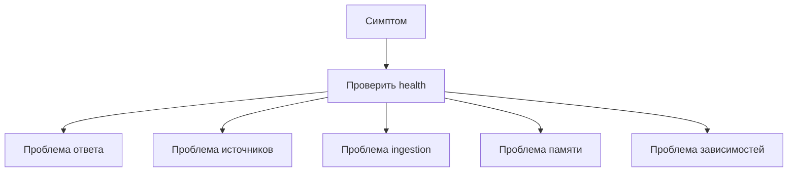

# Troubleshooting map — карта диагностики

Эта страница помогает понять, какой контур платформы деградировал. Начинайте не с поиска строки в логах, а с определения симптома: ответ, источники, память, ingestion или readiness.

## Быстрый маршрут

## Ответ есть, но источники слабые или отсутствуют

| Что проверить | Зачем |
|---------------|-------|
| [search_kb](../retrieval/search-kb.md) | Вызывал ли агент поиск вообще. |
| [similarity_search](../retrieval/similarity-search.md) | Есть ли релевантные фрагменты после threshold. |
| [Ingestion pipeline](../ingestion/pipeline.md) | Попали ли нужные документы в базу знаний. |
| `/health/ready` | Доступны ли embeddings и vector store. |

Типовой вывод: если база знаний не содержит нужных документов или документы плохо обработаны, агент не сможет дать сильный ответ с источниками.

## Агент делает много tool calls или завершает ответ ошибкой

| Симптом | Возможная причина |
|---------|-------------------|
| `max_rounds` | Агент не дошел до final из-за повторных tool calls. |
| `parse_fallback` | Модель вернула неструктурированный текст вместо шага. |
| Нет `sources` | Tool не был вызван или retrieval вернул пустой результат. |
| `status=error` | Недоступна LLM или runtime-зависимость. |

Читать: [Agent runtime](../runtime/agent-runtime.md), [API](../operations/api.md).

## Память кажется непоследовательной

| Симптом | Объяснение |
|---------|------------|
| UI показывает историю, но агент не учитывает прошлый вопрос | UI history не равна server memory. |
| Агент “помнит” старый контекст | Используется тот же `session_id`. |
| Разные ответы при похожем UI | Разные session memory или разный retrieval результат. |

Читать: [Session memory](../memory/session-memory.md).

## Ingestion job завершился `failed`

| Что проверить | Почему |
|---------------|--------|
| Статус job | Понять, ошибка в очереди или pipeline. |
| Доступность embeddings | Без embeddings документы не станут searchable. |
| Доступность vector store | Без индексации поиск не обновится. |
| Поддерживаемость формата | Не каждый файл можно корректно разобрать. |

Читать: [Worker](../ingestion/worker.md), [Pipeline](../ingestion/pipeline.md), [Ops](../operations/ops-and-risks.md).

## Readiness `degraded`, но API отвечает

Это нормальная модель. `live` показывает, что приложение живо. `ready` показывает, что весь контур готов к качественному ответу. Если readiness degraded, смотрите поле `blocking` и соответствующую зависимость.

| Dependency | Что означает деградация |
|------------|-------------------------|
| LLM | Агент не может сформировать ответ. |
| Embeddings | Retrieval и ingestion деградируют. |
| Vector store | Источники недоступны. |
| Postgres | Jobs или server memory работают некорректно. |
| Storage | Проблемы с исходными документами или копиями. |

## Legacy API дает другой результат

Primary path — `POST /chat/agent`. Старые endpoint могут использовать другой поток и pre-RAG. Для обучения и будущего продукта ориентируйтесь на agent runtime + `search_kb`.

## Быстрые ссылки

- [Reading paths](reading-paths.md)
- [Cheat sheet](cheat-sheet.md)
- [Ops & risks](../operations/ops-and-risks.md)
- [Open questions](../audit/open-questions.md)
