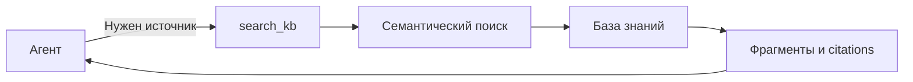

# Tool: `search_kb`

`search_kb` — контролируемый вход агента в корпоративную базу знаний. Агент вызывает его только тогда, когда для ответа нужны документы, стандарты, политики или другие источники.

## Роль в архитектурном контуре

## Почему это лучше обязательного pre-RAG

- Простые вопросы не перегружаются лишним контекстом.
- Агент сам формулирует поисковый запрос.
- Trace показывает, когда и зачем был вызван поиск.
- Citations связывают ответ с корпоративными источниками.

## Детальный контракт

См. [generated/06-tools-search_kb.md](../generated/06-tools-search_kb.md).

[← Retrieval](index.md) · [Legend](../legends/search-kb-sequence.md)
