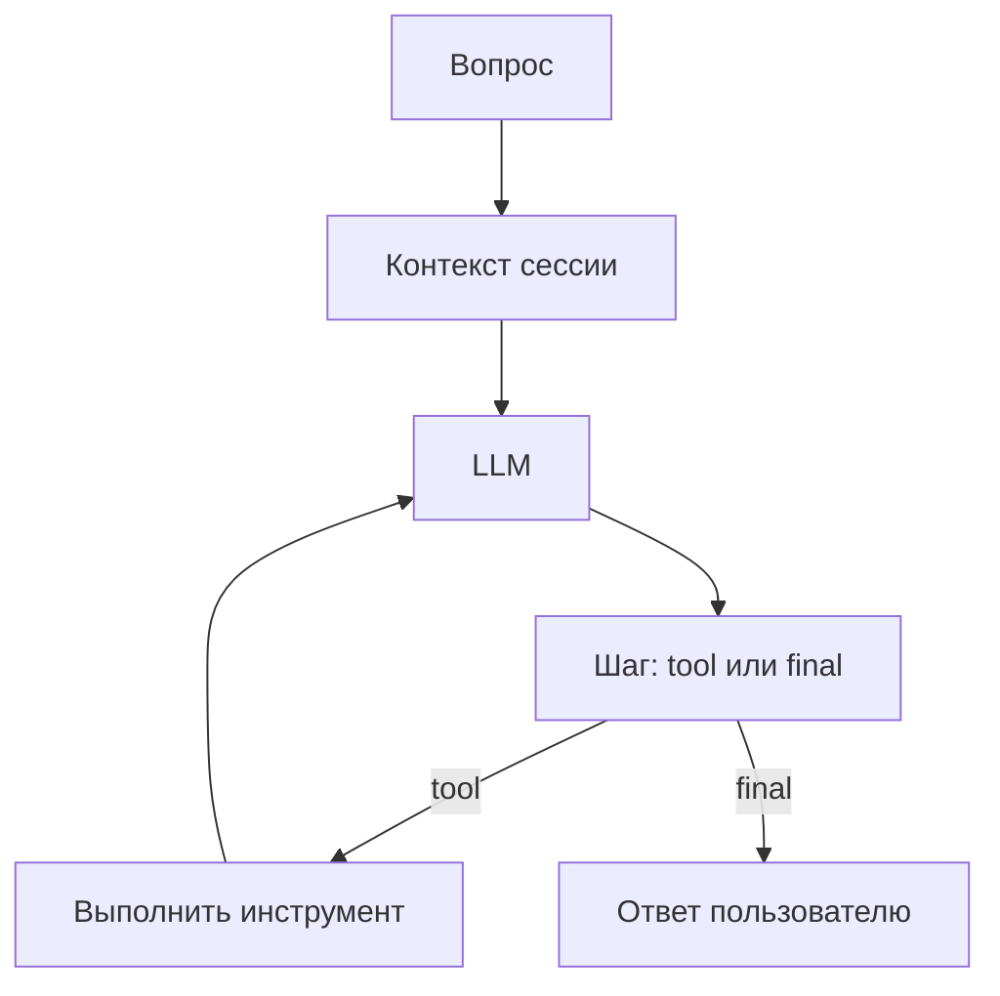

# Agent runtime: управляемый цикл рассуждения

Agent runtime — это сердце платформы. Он превращает пользовательский вопрос в управляемую последовательность шагов: подготовить контекст, вызвать LLM, понять намерение модели, выполнить инструмент при необходимости, вернуть ответ и сохранить контекст.

## Простая модель

## Почему runtime важен

Без runtime LLM была бы просто генератором текста. Runtime добавляет управляемость: ограничивает число tool calls, собирает trace, возвращает sources, сохраняет память и завершает поток структурированным событием `close`.

## Главный пользовательский API

`POST /chat/agent` — потоковый чат. Ответ приходит событиями: `status`, `tool_call`, `sources`, `text`, `introspect`, `close`.

## Детальный разбор

См. [generated/04-agent-runtime.md](../generated/04-agent-runtime.md).

[← Runtime](index.md) · [API](../operations/api.md)
